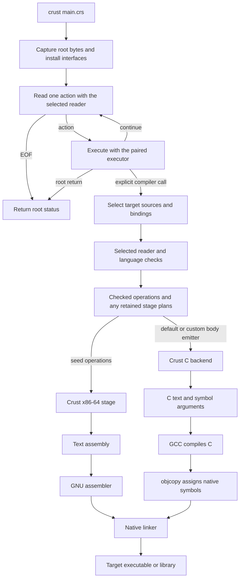

<!-- SPDX-License-Identifier: Apache-2.0 -->

# Crust core and compiler design

Crust keeps a small language core and exposes the compiler as libraries.
`crust main.crs` executes a compilation program. That program selects its
inputs, language rules, and backend through ordinary calls.

Keep the basic compilation path fast through backend handoff. The root program
can select stronger checks with a higher compilation cost. Measure each selected
configuration and state its guarantees; a slower optional check is not a design
failure by itself.
Explicit types, direct name lookup, and separate declaration facts keep
the core work bounded. Richer rules belong to selected stages. A program
that does not select those stages does not run their compiler passes or
receive their runtime machinery.

This guide describes the current implementation and its extension contracts.
The [Crust0 specification](crust0-spec.md) defines the seed language rules.
The [exploration archive](exploration/README.md) retains research, proposals,
and earlier experiments; their candidate syntax does not extend the seed.

## The language core

Crust0 is the bootstrap language used to write compiler libraries. Its core
provides enough data and control flow to implement readers, checkers, and
emitters:

| Core facility | Purpose |
| --- | --- |
| Fixed-width integers, `usize`, `isize`, and `bool` | Tags, offsets, arithmetic, and conditions |
| Nominal records and fixed arrays | Compiler nodes, tables, and explicit layout |
| Raw pointers and layout queries | Graphs, buffers, foreign data, and field addresses |
| Typed function values and foreign calls | Compiler operations, callbacks, and native services |
| Explicit declarations and signatures | Name binding and body checks without type inference |
| Variables, blocks, assignment, `if`, `while`, and returns | Ordinary algorithms |

`unit` is a function result with no stored value. Function parameters are
scalar; results are scalar or `unit`. Records and arrays can be constructed
and copied locally. Seed functions pass them through explicit pointers.
A richer frontend can define its own aggregate call convention.

Every parameter, result, local, constant, and field has an explicit type.
Calls require exact argument types. Integer literals carry a type suffix,
such as `1u32`. The parser recognizes syntax without declaration lookup.
There is no overload candidate search or implicit conversion search in the
seed checker.

All seed values are copyable. Copies do not allocate, call user code, or
transfer ownership. Arithmetic follows the specified wrapping and trap
rules. Operands, callees, and arguments evaluate from left to right. Raw
memory access requires valid, live, correctly sized storage; the seed does
not prove those preconditions.

Ownership, loans, RAII, `defer`, and `unsafe` policy belong to language
stages. So do overloads, module policy, and alternate syntax. The core has
no garbage collector, implicit cleanup, generics, exceptions, or universal
language IR. A frontend can represent richer types as ordinary data and
use a backend that understands them.

## Compilation is a source program

The root file runs from its first action. The launcher supplies
`run: *CrustRun`, an immutable source snapshot, compiler interfaces, and
ordinary host helpers. The default runner then repeats:

1. Capture the current reader, executor, and user state pointer.
2. Read one complete action and commit its end offset.
3. Check and execute that action with the default executor, or call the
   selected replacement executor.
4. Read the next action with the operations now stored in `run`.

A root action can load a stage, compile a target, or change how later bytes
are read. It cannot change syntax already read as part of that action.
Root compound statements end with a semicolon so this boundary is exact.

The following diagram shows a root that calls a compiler library. The target
pipeline runs only because the source makes that call.



The backend branches are alternatives chosen by the compilation program.
Successful compiler calls return to the root. The resulting target program
runs separately. A root can also interpret actions directly, emit source,
or produce only an object file. The resource stage's exit plans require its
C body emitter; the assembly stage does not consume those plans.

### One file can contain both programs

The [Hello World source](../examples/hello/main.crs) loads the C stage API
and shared library, prepares an output argument array, and ends with:

```crust
return c_build((*run).source, (*run).cursor, 2i32, &arguments[0usize]);
```

The cursor is already after this return statement's semicolon. `c_build`
compiles the remaining declarations in a separate target context. Target
diagnostics retain positions in the complete file. Root declarations do
not become target declarations, and the runner does not implicitly invoke
a target function named `main` at EOF.

Root declarations can use earlier declarations and themselves. A function
cannot capture root locals or refer to an unread root declaration. A whole
unit loaded through `host_source` can use forward references and mutual
recursion within that unit. Target declaration units have that same rule.

### Metacompilation uses ordinary execution

A metastage is a function or program that does compiler work. It uses the
same records, pointers, loops, and calls as other Crust code. The runner
executes checked host trees. Prepared libraries run as native code through
the normal foreign interface. Libffi supplies the evaluator's native call
and callback boundary.

Host interpretation has a configurable budget of 8192 active calls and
syntax visits by default. This permits the interpreted reader's full syntax
depth on the tested 8 MiB stack. It also bounds runaway recursion. The budget
counts more than one visit per function call. Embedders must provide enough
stack for their budget and native callees. See the
[execution contract](source-runner.md#execution-and-lifetime).

`host_source` checks a host declaration unit. `host_link` loads an explicit
shared-library path. It does not compile changed library source. Stage code
must already be available before a call uses it; preparing that code is an
explicit build dependency. A root can also define and execute stage functions
directly, as the [reader switch](../examples/reader-switch/README.md) does.

The intended startup policy keeps the seed evaluator small. An early root
action selects a backend, prepares its native code with an available compiler
configuration, and installs the execution stage for subsequent compilation
code. A backend can then compile its next generation explicitly. ASM and C
are the available emission paths; LLVM requires a separate adapter stage.

This handoff uses `CrustRun.read`, `execute`, and `user`. Loading a library
with `host_link` alone leaves the default root executor in place. The selected
stage must take responsibility for later code execution as well as emission.
The [native stage tutorial](../stages/native/README.md) supplies this handoff.
It starts with explicit source inputs and a selected assembly stage,
then compiles and executes complete function actions. Its same-file example
changes the next unit to C compilation and builds a final executable.

Keep this policy in Crust code. The seed must not identify a backend by its
name or source path. Preserve completed effects, persistent storage, and
published callable identities across the handoff. Compile complete functions
or explicitly selected units. Their boundaries must preserve source-order
effects and ownership of unread bytes.

There is no required `meta` block, separate build script, or backend-specific
launcher option. Arguments after the root path are data for the root to
interpret. Earlier effects remain if a later action fails. EOF performs no
implicit build, task join, or publication of pending output.

## Compiler stages and their data

The frontend API is in [include/crust0.h](../include/crust0.h) and the
matching [Crust declarations](../api/crust0.crs). Assembly operations use
[include/crust0_x64.h](../include/crust0_x64.h) and
[api/crust0_x64.crs](../api/crust0_x64.crs):

| Boundary | Input and result | Public operation |
| --- | --- | --- |
| Read | Source bytes to syntax with original locations | `crust_read`, `crust_read_range` |
| Bind providers | A visible name and complete external declaration facts | `crust_bind` |
| Collect | Owned declarations to the top-level name table | `crust_collect` |
| Resolve | Names and type syntax to signatures, layouts, and type facts | `crust_resolve` |
| Check | Resolved declarations and a body to checked operations | `crust_check_body`, `crust_check` |
| Prepare assembly | Checked input and native names to storage and expression plans | `crust_x64_prepare` |
| Emit assembly | A prepared plan to complete assembly text | `crust_x64_emit_program` |

Whole-unit compilation collects declarations before checking bodies. Root
execution uses `crust_read_one`, the incremental unit operations, and
`crust_check_root`. It checks each new action against facts already available.
It does not rescan all earlier actions after every declaration.

These boundaries are callable operations, not a required pass manager or
serialized intermediate files. A stage can construct valid input directly
and skip the producer it replaces. Public syntax, type, declaration, and
backend records expose the required data. Package versions define their
layouts; there is no permanent binary ABI between arbitrary compiler versions.

Syntax expressions and statements are trees of distinct occurrences.
Complete declaration and type facts can be shared under their lifetime
contract. A backend can trust checked facts. A replacement producer must
establish those facts before it calls the consumer.

### Module management belongs to the caller

The seed accepts selected sources and explicit bindings. It does not search
for imports, choose visibility, resolve packages, or assign a module-based
mangling scheme. The supplied host helpers use a flat namespace. Loading
the same definitions twice is an error.

A module stage can collect interfaces, select visible names, assign stable
declaration identities and native names, and bind those facts into consumer
contexts. `crust_bind` borrows complete provider facts; it does not add the
provider's definitions to the consumer's output units. Providers must stay
live and unchanged until their consumers finish.

The [multiple-file example](../examples/multiple-files/README.md) selects
sources explicitly. The [separate-object example](../examples/overload/separate/README.md)
uses a shared source interface and stable overload names across two builds.
Neither requires a package resolver in the seed.

## Extension points

Replacement can be small or complete. Use the interface that matches the
data your stage needs to change.

| Extension | Interface | Working example |
| --- | --- | --- |
| Replace unread root syntax and action execution | `CrustRun.read`, `execute`, and `user`; the action is an opaque pointer | [Reader switch](../examples/reader-switch/README.md) |
| Extend the Crust declaration grammar | `CrustReaderHooks` for declarations, statements, prefixes, and types | [Reader library](../stages/reader/README.md) |
| Construct or transform seed input | Public nodes, bindings, identities, and checking operations | [Custom reader](../examples/custom-stage/README.md) |
| Add source name and type rules | An ordinary pass before the next checker | [Overload stage](../stages/overload/README.md) |
| Add ownership and cleanup rules | Source checker, separate lowered types, and retained exit plans | [Resource stage](../stages/resources/README.md) |
| Change one assembly operation | `CrustX64Ops.expression`, `place`, or `statement` | [Custom assembly operation](../examples/custom-stage/README.md) |
| Supply complete C function bodies | `c_emit_with_body` or `c_backend_build_with_body` | [Resource body emitter](../stages/resources/emit.crs) |
| Replace the backend | A library that consumes its chosen representation and produces output | [C backend](../stages/c/README.md) |
| Classify source for display | User services append source spans; consumers render HTML or editor tokens | [Highlighting tutorial](../stages/highlight/README.md) |

The Crust reader library is separate from the seed reader. Its four hooks
extend target syntax without adding keywords to the C99 parser. Replacing
the root reader and executor can replace the entire grammar of unread root
bytes. Install both operations in one action, and keep their code, action
data, and user state live through execution. The callbacks receive the captured
user pointer as an explicit argument. A change to `run.user` selects state for
the next action. The captured operations and state finish the current action.

Check a source rule before lowering discards the facts that express it.
For example, overload selection must distinguish `read T` from `mut T`
before both become pointers. The resource checker must retain cleanup plans
through emission. Its checked operation trees alone omit cleanup that the
body emitter obtains from those plans.

A user frontend can instead keep its own syntax, type system, checker, and
IR. Seed types do not have to represent every target type. Reusing a seed
consumer still requires its input contract; using another consumer requires
that consumer's contract.

## External assembly and C backends

Both backends are ordinary Crust libraries. The root selects their sources
or native artifacts, then calls their public operations. The C99 seed has
no instruction emitter.

| Property | Crust assembly backend | Crust C backend |
| --- | --- | --- |
| Implementation | [stages/asm/](../stages/asm/README.md), written in Crust | [stages/c/](../stages/c/README.md), written in Crust |
| Input | Checked seed operations with native names | Checked declarations and default bodies, or a custom complete-body callback |
| Output | Text x86-64 assembly | C text and a symbol response file |
| Native toolchain | GNU assembler and linker | GCC, `objcopy`, and linker |
| Code optimization | Direct emission without an optimization pipeline | GCC optimizes the generated C |
| Customization | Public preparation data and expression, place, and statement operations | Public buffers, types, emission helpers, and complete body callback |
| Command wrapper | `build/crust0` | `build/crust-c` |

Both current backends select Linux x86-64 and the System V scalar ABI for
seed functions. The C output uses GCC-specific operations to preserve seed
arithmetic, evaluation order, and raw address behavior. It is not a portable
C target for arbitrary machines. A different target needs explicit layout
and ABI rules; the host's `sizeof` is not a target description.

The `crust` executable and `libcrust0.a` contain neither emitter. `crust0`
is a standalone consumer linked to the external assembly stage. The C stage
uses the same frontend services and ordinary native host calls.

The Make build interprets [bootstrap.crs](../stages/c/bootstrap.crs) to compile
the first C backend with GCC. That backend compiles itself, then builds the
assembly stage. No generated C, object, or archive is a source dependency.
`make check-c check-asm` checks successive backend generations and runs the
intrusive-list program built by each final generation.

The [cached root](../examples/cached-backend/README.md) provides another
bootstrap route. It interprets the assembly stage in a separate context on
a miss, then assembles and links the selected native stages. A hit loads the
same file directly. The root installs its compiler and executor explicitly.
The reader, checker, evaluator, and runner remain C99. A separate Crust reader
library is available to stages that select it.

An LLVM adapter belongs at the same library boundary. There is no LLVM
adapter in the current tree. Such an adapter must implement target layout
and ABI mapping, operation lowering, IR construction, pass options, and
emission. It must preserve source trap and alias rules. Exposing that adapter
does not by itself expose LLVM's internal algorithms.

## Lifetimes, parallel work, and cost

Contexts own arenas for compiler nodes, names, tables, and plans. Source
descriptors and bytes remain live through their consumers. A supplied
binding borrows its provider facts. Native callbacks and loaded library
code remain live until all uses finish. The default runner destroys its
evaluator before unloading libraries. The launcher then releases its host
context.

One mutable context and each syntax body have one writer. Independent
contexts can read sources, check bodies, and emit output in parallel while
sharing complete, immutable provider facts. Stable identities and diagnostic
order must not depend on worker completion order. The current drivers are
serial; the public interfaces permit a library to schedule independent work.

The root cursor has a serial dependency because an action can select the
next reader. A host evaluator also requires exclusive access from one
thread, though it permits synchronous callback reentry. These constraints
do not require independent target compilations to share that evaluator or
mutable context.

The [artifact cache](../stages/cache/README.md) uses captured inputs and an
explicit producer. Include stage and helper code, compiler and ABI identity,
target settings, options, and all external inputs. Optional file lookups must
encode absence as well as presence. The producer owns only its output and
scratch files. Root effects run on every invocation. No context, address, or
execution state is stored. Cold measurements include stage preparation.

Keep frontend checks, stage execution, emission, and target toolchain time
separate. Assembly `--prepare` builds storage plans but leaves instruction
selection to emission. C `--prepare` constructs complete C and symbol text
in memory. These endpoints are different. Exclude target GCC compilation
and linking from the current frontend measurements. Passing a functional
test does not establish C-level compilation speed for that configuration.

## Checked ownership target

Checked Crust has two requirements: no whole-program ownership analysis, and a
user-facing ownership model no more complex than Rust's. These are design
requirements. The closed-program memory proof stages do not implement this
model. The separate modular stage below implements a bounded source subset.

Check each function against its declared contract. Use its body, declared type
and field contracts, and the interfaces of called functions. Local flow analysis
and local inference are permitted. A caller must not inspect a callee body or
depend on a selected program entry to establish safety. Library checking must
not require a client or a `main` function. Recursive calls use declared contracts;
they must not require call expansion.

All conditions that cross a function boundary belong in the published interface:

| Declaration | Facts that it must express when required |
| --- | --- |
| Function | Access rights, ownership transfer, returned or retained loan relationships, and initialization and destruction effects |
| Type and field | Ownership or borrowing of stored values, lifetime relationships, access rights, and required address stability |

These are required facts, not proposed keywords. Infer local details where the
interface permits it. A body must establish its declared result and preserve the
type's field rules. Destructors and intrusive-link operations receive the same
checks as other functions. Foreign contracts remain an explicit trust boundary;
a trusted unlink operation cannot replace a checked implementation.

A caller's safety result depends on the published contract, not the callee's
implementation. A changed implementation must still pass its own check. Once
interfaces are available, independent bodies can be checked in parallel. Cache
each body result against its source, imported contracts, types, and checker
configuration. Do not use a saved closed-program proof as a library contract.

Rust's [lifetime signatures](https://doc.rust-lang.org/book/ch10-03-lifetime-syntax.html#in-function-signatures)
give a comparison for caller-visible lifetime relationships. The complexity
limit applies to both applications and container implementations. Compare
the concepts, annotations, and error recovery for the same operations; a keyword
count alone is insufficient. Ordinary ownership code must not require manual
SMT terms, ghost lemmas, loop proofs, or a custom proof policy for each container.
Checker internals can use stronger analysis, but must obey the function boundary.
Memory safety must not require proof that every loop terminates.

The next acceptance gate is one direct intrusive-list library and a separate
client with a runtime number of nodes:

1. Check each library function without the client. Check the client using only
   the verified interfaces, without reading or expanding library bodies.
2. Exercise two hooks, traversal, individual unlink and destruction, storage
   reuse, and head cleanup while another owner remains live. Keep ordinary
   pointer fields, with no pool requirement, runtime ownership metadata, or
   `unsafe` region in the list implementation or client.
3. Reject stale cursors, destruction with a live conflicting loan, invalid moves
   of linked storage, and invalid contract implementations. An unfolding budget
   must not substitute for a contract that works at arbitrary list lengths.
4. Compare source obligations with Rust for both library and client. Check
   emitted code and measure library and client checking separately. Do not
   extend the model if this witness needs more complex user proofs.

The ordinary resource stage does not provide this reusable list contract. Keep
the closed-program proof experiments as evidence. Do not expand their heap-graph
machinery as a substitute for passing this gate.
The [modular candidate](exploration/resource-metastage.md#7-modular-ownership-candidate)
combines stable individual owners, scoped access, and reciprocal field contracts.
Its restricted internal group rule addresses sentinel and payload types. The
[annotated intrusive tutorial](../examples/intrusive/README.md) now implements
that rule, declared owners, domain access, construction, and destruction in
external Crust stages. It checks link definitions without a client, and all
callers use declared interfaces. Named read and mutable loans, dotted returned-view
origins, and embedded-resource destruction now have local contracts.
Runtime-sized owner creation still needs a local invariant
for a changing owner set. This result does not complete the general container
and Rust source-complexity gate.

## Current safety stages

Safety claims follow the selected stages. Raw seed pointers do not
justify ownership guarantees or exclusive-access metadata. The resource
stage checks local owners, loans, and returned views tied to a named input.
The [modular ownership stage](../stages/ownership/program.crs) checks function
bodies independently. Record suffixes declare owned pointers, member origins,
anchors, and domains. Function suffixes declare access and link results. The
[relation stage](../stages/relations/check.crs) verifies inverse pointer fields,
anchor identity, and arbitrary-size head-drain loops. Calls consume interfaces;
they do not expand bodies. The local checker verifies owners, initialization,
fixed storage, cursor scopes, projection, and resource destruction. The seed is
unchanged, and checks add no target operations. The tutorial specifies accepted
source shapes and the contracts required to accept other shapes.

The optional [memory proof stage](../examples/ownership/README.md) checks
closed sequential entries through the typed seed tree. It gives allocations
distinct proof identities, checks accesses and destruction, and proves that
loops cannot continue beyond the selected unfolding bound. These identities
do not occur in emitted code.

Resource cleanup also exists in retained exit plans, so its lowered operation
tree alone is not a complete memory-checking input. The optional
[closed-program composition](../examples/intrusive/README.md#closed-program-proof-examples) reconstructs
source storage scopes, executes the exit plans, and consumes initialized-field
permissions after owner transfers and consuming pointer reads. A pointer move
can consume a destructor's node field without a runtime clear store. Alias
reads must respect the consumed field permission. The profile uses the original
resource body emitter.
It also checks initialization of plain values through aliases, output calls,
and cleanup. Resource lowering delegates that rule explicitly while retaining
owner construction, moves, loans, and cleanup eligibility. It adds no target
initialization stores or flags.
The root can select inferred summaries for straight-line memory functions.
The stage derives each effect template from the complete checked proof view,
then checks its obligations and typed-write separation at each call. It retains
written pointer cells for later destruction checks. Other calls expand their
actual bodies. These templates do not establish abstract ownership predicates
or loop invariants. The separate ring proof is not a caller memory summary.
An optional [declared call contract](../examples/intrusive/README.md#check-a-declared-call-contract)
proves a selected body against input conditions, exact output maps, and a finite
set of writable cells. It checks every intermediate write as well as the final
memory frame. Each caller must establish the verified contract's conditions.
This form supports branches in scalar, loop-free unit functions. It adds proof
work and still uses concrete memory effects at call sites. It supplies no
abstract graph predicate or inductive loop rule. All contract code and its
preparation callback are in ordinary Crust stages.
The optional [traversal stage](../examples/intrusive/README.md#check-a-runtime-sized-traversal)
adds loop induction through the existing statement callback. It derives the
modified scalar bindings, proves invariant entry and preservation, and proves
a decreasing natural-number variant. It retains checked exits and requires
unchanged memory maps. This permits runtime-sized traversal followed by RAII
unlink and storage retirement. Memory-changing loops reject. They require a
frame rule for changed storage and retained links. Proof terms add no target code.
Native host execution is trusted process code, with no sandbox guarantee.

## Read next

- [Tutorials and examples](../examples/README.md): run the stages and inspect output.
- [Language specification](crust0-spec.md): syntax, values, memory, and construction contracts.
- [Runner contract](source-runner.md): action boundaries, native calls, errors, and teardown.
- [Bootstrap guide](bootstrap.md): build commands, assembly interfaces, and validation.
- [C backend reference](c-backend.md): emission, symbol mapping, and custom bodies.
- [Exploration archive](exploration/README.md): research and recorded design decisions.
