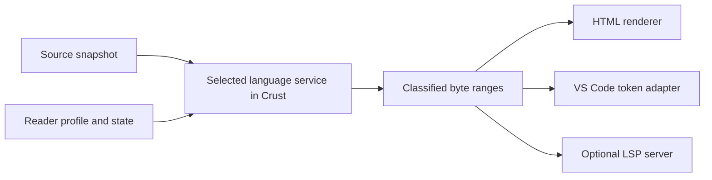

# Syntax highlighting through user stages

Date: 2026-10-01.

Status: design study. The reader probe below uses the implemented API at
revision `39b70ae`. The highlighting interface and editor adapter are proposals.
This document does not add a compiler contract.

The [highlighting tutorial](../../stages/highlight/README.md) describes the
implemented seed service, custom reader example, HTML output, and VS Code
adapter. The proposals below retain the original investigation scope.

## Decision

A normal Crust program can read a source file and produce highlighted HTML.
Keep the language rules in Crust libraries. Return classified source ranges
from those libraries. Use separate consumers for HTML and editor tokens.

This work belongs in user stages. It does not require a highlighting keyword,
a new C99 core stage, or a backend invocation. Syntax classification need not
run the type checker or ownership checker. Symbol classification can use
those stages when the user selects it.



## What the current reader provides

The [reader library](../../stages/reader/README.md) is written in Crust.
Its [token record](../../stages/reader/model.crs) has a kind, an original byte
offset, a length, and a pointer to the original text. `rr_init` and `rr_next`
expose these tokens without a complete parse. A highlighter can classify
keywords, punctuation, numbers, and strings from this information.

The current reader also does work which basic coloring does not need.
It interns names, converts numbers, and allocates decoded strings.
Use the original range for display. For example, a string escape occupies
more source bytes than decoded bytes.

Three contracts require more work:

| Operation | Current behavior | Highlighting requirement |
| --- | --- | --- |
| `rr_skip` in [lex.crs](../../stages/reader/lex.crs) | Consumes spaces and line comments | Expose comment ranges and preserve all source text |
| `rr_next` | Stops after a lexical error; failure stays set | Return useful ranges for incomplete source and resume at a defined boundary |
| Reader hooks in [model.crs](../../stages/reader/model.crs) | Return compiler nodes | Classify the syntax owned by each extension |

Do not clear `reader.failed` to resume a scan. On failure, the current token
can lack a complete range. Separate tolerant token scanning from literal
validation. The compiler must retain its strict rejection rules.

The [resource reader](../../stages/resources/read.crs) recognizes words such
as `defer`, `move`, and `read` through hooks. These words are identifiers in
the base lexer. Their classification depends on the selected reader and
their position. A global list of extra keywords would misclassify ordinary
names.

The [core source location](../../include/crust0.h) gives a starting offset.
It does not give each identifier's complete range. AST locations alone
cannot reconstruct all spelling, comments, or names before overload mangling.
An optional highlighting consumer must retain those source ranges before
the relevant transformation.

## Reader probe

A temporary Crust client linked `api/crust0.crs`, `api/crust0_host.crs`,
`stages/reader/model.crs`, and `stages/reader/lex.crs`. It loaded each source,
called `rr_init`, and printed kind, offset, and length until EOF or failure.
It used the existing `build/crust-c` to compile and link the client.

| Input | Observed result |
| --- | --- |
| `// comment` followed by a newline and `fn main()->i32{return 0i32;}` | First token is `fn` at byte 11; no comment token |
| `defer move read mut unsafe resource drop` | Seven `RR_NAME` tokens |
| `"a\n\x62"` | One `RR_STRING` token with source length 9 |
| `fn before()->unit{}` followed by an unfinished string and another function | Eight tokens before the string; diagnostic `invalid byte in string literal`; another `rr_next` call consumes nothing |

The client also checked ordered, non-overlapping ranges within three files:

| Source | Bytes | Tokens |
| --- | ---: | ---: |
| [Hello world](../../examples/hello/main.crs) | 544 | 128 |
| [Reader switch](../../examples/reader-switch/main.crs) | 1832 | 440 |
| [Resource reader](../../stages/resources/read.crs) | 3946 | 888 |

These counts describe the bytes at the stated revision. They prove access
to source ranges. They do not prove correct colors for the custom grammar
in the reader-switch example. No latency measurement was made.

## Small shared interface

The following record is a proposed library type:

```crs
record HighlightSpan {
    begin: usize;
    end: usize;
    kind: u32;
    modifiers: u32;
}
```

`begin` and `end` form a half-open byte range in one immutable source
snapshot. The result identifies that snapshot and its document version.
It also defines the type and modifier legend. The ranges are ordered,
non-empty, disjoint, and inside the snapshot. Unclassified text needs no
range. Consumers preserve it.

Use classifications such as `keyword`, `comment`, `string`, `number`,
`operator`, `function`, and `variable`. Use modifiers such as `declaration`
and `readonly` where the language service establishes them. Themes select
colors. The compiler must not assign RGB values to language constructs.

A service consumes a snapshot, a source range, and its selected reader
state. It returns spans and diagnostics. A syntax error can leave a useful
partial result. Allocation failure, an invalid result, and a missing
language service must have distinct, visible outcomes. Do not present an
unknown language region as fully classified.

The HTML consumer copies source text between spans and wraps classified
text in elements with fixed CSS classes. It escapes source text, including
`&`, `<`, and `>`. It never inserts source bytes as HTML markup. Invalid
text bytes need a declared display policy, such as visible byte escapes.

The editor consumer accepts an unsaved text snapshot, not only a file path.
It checks results at the process boundary and rejects stale document
versions. The service can remain an ordinary Crust executable or library.
The VS Code adapter supplies the small amount of editor-specific code.

## Reader selection is the hard boundary

The [source runner](../source-runner.md) executes actions in source order.
An action can replace the reader for subsequent bytes. It can also read
files, load native code, run a process, or fail to terminate. The current
`CrustRun` has no highlighting service or map of language regions.

The [reader-switch example](../../examples/reader-switch/main.crs) shows
the problem directly. Its final lines use a custom text grammar. A callback
address and an opaque action pointer do not describe that grammar to an
editor.

Pair a syntax extension with an optional highlighting service in ordinary
Crust code. A project can publish this service from its source program,
using the same libraries that select its compiler stages. No separate
configuration language is needed. A reader which already has a concrete
syntax representation can classify that representation directly.

There are two distinct uses:

1. A trusted compilation program can collect source ranges during its
   normal run and produce HTML as another output. This includes the normal
   effects and errors of that run.
2. An editor calls an explicit analysis entry point with a snapshot and
   selected language configuration. This entry point must classify text
   without running the target build. A fixed seed profile can work without
   executing the input program at all.

Arbitrary source programs cannot provide exact automatic reader discovery
without evaluating the computation that selects each reader. A flag named
`highlight` does not remove this dependency or enforce the absence of
effects. If reader selection depends on unavailable effects, report the
affected region as unresolved. To resolve it, the project must provide an
analysis configuration or an explicit trusted evaluation path.

Do not execute the ordinary root on each keystroke. Loading a project
analysis service still executes project code. Gate that path with
[VS Code Workspace Trust](https://code.visualstudio.com/api/extension-guides/workspace-trust).
Use cancellation and process limits for editor responsiveness. A separate
process is not a sandbox.

## VS Code interfaces

VS Code has two relevant extension interfaces:

| Interface | Extension supplies | Fit for Crust |
| --- | --- | --- |
| TextMate grammar | A grammar file through `contributes.grammars`; language registration through `contributes.languages` | Fast baseline for a fixed grammar |
| Semantic token provider | Token ranges, type indices, and modifier bits | Output from a Crust language service |

TextMate rules use regular expressions. They cannot execute arbitrary Crust
reader logic. A static seed grammar can be useful, but its colors do not
establish the grammar of a dynamically selected reader.
[Syntax Highlight Guide](https://code.visualstudio.com/api/language-extensions/syntax-highlight-guide)

For the direct adapter, register a `SemanticTokensLegend` with
`languages.registerDocumentSemanticTokensProvider`. Implement
`provideDocumentSemanticTokens(document, cancellationToken)` and return
`SemanticTokens`. `SemanticTokensBuilder` can construct the result.
The provider API can carry lexical classifications; a complete type check
is not a prerequisite. Colors depend on the theme and the
`editor.semanticHighlighting.enabled` setting.
[Semantic Highlight Guide](https://code.visualstudio.com/api/language-extensions/semantic-highlight-guide)

The compact token representation is five integers per token:

```text
[deltaLine, deltaStart, length, tokenType, tokenModifiers]
```

Lines and columns start at zero. On the same line, `deltaStart` is relative
to the previous token's start. On a new line, it is relative to column zero.
The first token is relative to line zero, column zero. VS Code columns and
lengths use UTF-16 code units. Convert Crust byte offsets using the exact
snapshot sent to the service. Split spans at line breaks. A UTF-8 byte
offset cannot be passed directly to `document.positionAt`.
[VS Code API declarations](https://github.com/microsoft/vscode/blob/main/src/vscode-dts/vscode.d.ts)

An LSP server is optional. For that route, advertise
`semanticTokensProvider` with a legend and `full: true` during initialization.
Handle `textDocument/semanticTokens/full` and return `{ "data": [...] }`.
Use [document synchronization](https://microsoft.github.io/language-server-protocol/specifications/lsp/3.17/specification/#textDocument_didChange)
to obtain unsaved text. Use the negotiated position encoding. Only advertise
range or delta support when implemented. LSP uses the same five-integer
token format.
[LSP semantic token specification](https://microsoft.github.io/language-server-protocol/specifications/lsp/3.17/specification/#textDocument_semanticTokens)

HTML is the output for a browser. Editor coloring consumes classified
ranges. Bracket matching, comment commands, diagnostics, and navigation
have separate contracts; semantic colors alone do not implement them.

## Bounded implementation experiment

Start with one Crust span producer and an HTML consumer. Use a fixed seed
profile first. Add the direct VS Code adapter after the span contract works.
Do not require LSP, a persistent cache, or a new core registry for this step.

Before declaring the extension model sufficient, test its difficult case:
the reader-switch example must classify both grammars from explicit
configuration. Then check contextual resource words and original overload
names. A successful seed lexer demonstration does not settle this boundary.

The experiment must also establish these results:

- Incomplete strings and invalid tokens produce bounded recovery. A later
  valid line remains available for classification.
- Comments and all source text survive HTML rendering. HTML metacharacters
  remain visible text.
- Unsaved edits, CRLF, and non-ASCII text in comments and strings map to the
  correct editor columns, including characters that require two UTF-16 units.
- An obsolete request can be cancelled. Its result cannot color a later
  snapshot.
- Analysis does not invoke GCC or run target code. An unavailable custom
  service produces an explicit unresolved result.

Measure scan time, classification time, rendering time, adapter time, and
service startup separately. Use actual example files and a recorded large
source input. Record the revision, flags, commands, and median and tail
latencies. Establish the initial baseline before selecting a latency target
or adding incremental state. Exclude helper compilation and target GCC
compilation and linking from scan measurements.

Only cache results whose dependencies are known. A source revision alone
is insufficient if a language service also depends on reader code or
project configuration. Independent snapshots can use separate contexts;
source-order reader changes remain ordered within one snapshot.
