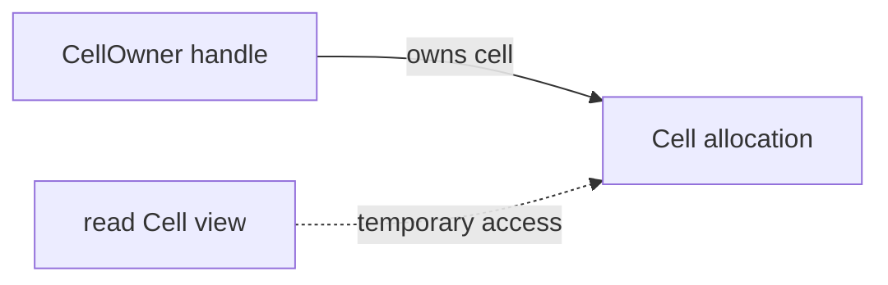

<!-- SPDX-License-Identifier: Apache-2.0 -->

# Ownership: a practical tutorial

Ownership answers two questions: who must clean up a value, and who can use it
before that cleanup? Crust checks these rules during compilation. An owner can
transfer a value. A borrower can use it for a shorter time. Destruction must
wait until conflicting uses have ended.

This tutorial teaches the implemented ownership stage. It includes general
owner and loan operations, plus a specialized intrusive-list verifier. The
stage fails the [generic ownership design requirement](design.md#checked-ownership-target):
it cannot express ordinary stored borrows and depends on list-specific rules
for persistent non-owning links. The examples describe this implementation;
they do not specify an accepted generic ownership model.

Start here if you can already write a function and a record. You do not need
to know the compiler implementation or a proof language.

Read the sections in order:

1. [Select the stage and run a program](#1-select-the-stage-and-run-a-program).
2. [Give a value a cleanup action](#2-give-a-value-a-cleanup-action).
3. [Transfer ownership](#3-transfer-ownership).
4. [Borrow for reads or changes](#4-borrow-for-reads-or-changes).
5. [Return a borrowed field](#5-return-a-borrowed-field).
6. [Own a heap allocation](#6-own-a-heap-allocation).
7. [Keep intrusive nodes at a stable address](#7-keep-intrusive-nodes-at-a-stable-address).
8. [Destroy embedded resources](#8-destroy-embedded-resources).
9. [Use library contracts](#9-use-library-contracts).

The [Rust comparison](ownership-rust.md) explains corresponding concepts,
differences in accepted code, and obligations for container authors.

The [generic ownership proposal](ownership-model.md) specifies the replacement
design. Its syntax is not implemented by this tutorial.

## 1. Select the stage and run a program

Run these commands from the repository root:

```sh
make all ownership-stage Z3_FLAGS=-l:libz3.so.4
build/crust examples/ownership-basics/main.crs
build/ownership-basics
```

Use `Z3_FLAGS=-lz3` if the development library is installed. The output is `BC`
and a newline. The [root file](../examples/ownership-basics/main.crs) loads the
ownership stage and compiles [program.crs](../examples/ownership-basics/program.crs).
The target program does not link Z3. The stage uses it to check intrusive link
implementations; this first example has no links.

To check a target file without producing an executable:

```sh
build/crust examples/ownership-basics/main.crs --check \
    examples/ownership-basics/program.crs
```

The root can also compile a copy of the target file. Pass `-o OUTPUT FILE` in
place of `--check FILE`. Target paths on this command line are relative to your
working directory.

The raw seed has no ownership guarantee. Selecting this stage is part of the
program's safety contract. The [resource stage tutorial](../stages/resources/README.md)
describes a different selection: local cleanup and `defer`, with raw memory
operations inside explicit `unsafe` adapters. Do not combine its guarantees
with this stage's guarantees without selecting and checking that composition.

## 2. Give a value a cleanup action

A `resource` is a record with automatic cleanup. The example uses a small
resource whose destructor prints one character:

```crust
resource Ticket { code: i32; } domain(Demo) drop ticket_drop;

fn ticket_drop(ticket: mut Ticket) -> unit access(reclaim, Demo) {
    var result: i32 = emit(ticket.code);
    if result < 0i32 { trap; }
}
```

The complete file declares `emit` as the C `putchar` function with a scalar-only
foreign contract. This printing action makes cleanup visible. A real resource
can instead release an allocation or another native resource.

A local such as `ticket` owns one `Ticket` value. The type defines its cleanup;
the owning local determines when cleanup runs. `mut Ticket` gives the destructor
access to the value without creating a second owner. Section 4 explains this
borrowed type.

`Demo` is an access domain: a compile-time name that groups storage and its
access rules. This stage requires reclamation authority for resource cleanup.
Thus the destructor and the example's `main` declare `access(reclaim, Demo)`.
There is no runtime `Demo` object, pool, common allocation lifetime, or lock.

| Function contract | Permitted use of its domain |
| --- | --- |
| `access(read, Demo)` | Read through valid views. |
| `access(edit, Demo)` | Change valid storage and checked links. Do not destroy owners. |
| `access(reclaim, Demo)` | Create and destroy owners when conflicting uses have ended. |

A function can use weaker access inside `read Demo { ... }` or
`edit Demo { ... }`. The block ends before the function recovers its outer
authority. These declarations do not provide thread synchronization.

Unless stated otherwise, the following statement examples replace the body of
`main` in `program.crs`. Keep its `access(reclaim, Demo)` contract and add
`return 0i32;` at the end. Other declarations in that file supply the helpers.

```crust
{
    var first: Ticket = make Ticket { code: 65i32 };
    var second: Ticket = make Ticket { code: 66i32 };
}
```

The block prints `BA`. Local resources drop in reverse declaration order.
Normal `return`, `break`, and `continue` exits also run applicable cleanup.
A process exit or `trap` does not unwind scopes. RAII is the name for this
association between a value's lifetime and its cleanup.

Use `drop` to perform cleanup before scope exit:

```crust
var ticket: Ticket = make Ticket { code: 65i32 };
drop ticket;
ticket = make Ticket { code: 66i32 };
```

This prints `AB`: the first value drops explicitly, and the replacement drops
at scope exit. There is no second cleanup of the consumed value. A `record`
with only scalar fields has no cleanup action; reading an integer copies it.

## 3. Transfer ownership

Use `move` when another local or function must take responsibility for cleanup:

```crust
var first: Ticket = make Ticket { code: 65i32 };
var second: Ticket = move first;
```

This prints `A` once when `second` leaves scope. `first` is no longer usable.
A move transfers the value; it does not clone the owned resource or increase
a reference count.

**Rejected: copying a resource.**

```crust
var first: Ticket = make Ticket { code: 65i32 };
var second: Ticket = first;
```

Two cleanup obligations would refer to one resource. Add `move` if the second
local must own it. Use a borrow if both pieces of code need temporary access.

**Rejected: using a moved value.**

```crust
var first: Ticket = make Ticket { code: 65i32 };
var second: Ticket = move first;
drop first;
```

Remove the last line. `second` now owns the cleanup obligation. A by-value
resource parameter transfers the same obligation to the callee; a resource
result transfers it back to the caller. The caller uses the signature to check
this transfer. It does not inspect the function body.

## 4. Borrow for reads or changes

A *loan* is the compiler's record of a borrow. A `read T` view permits reads.
A `mut T` view permits exclusive changes. Borrowing does not transfer cleanup.
The source spells both the requested borrow and the parameter type:

```crust
fn set_code(ticket: mut Ticket, code: i32) -> unit access(edit, Demo) {
    ticket.code = code;
}
```

Call it with `set_code(mut ticket, 66i32)` inside an `edit Demo` block.
The view uses ordinary field access. A borrowed scalar also uses its name
directly: write `view = 7i64`, rather than `*view = 7i64`.

Several shared views can coexist. An exclusive view excludes conflicting
reads and writes through other access paths. A named view lasts to the end
of its lexical scope, even if its last read occurs earlier.

**Rejected: changing a value while a named shared view is in scope.**

```crust
var count: i64 = 1i64;
var view: read i64 = read count;
if view != 1i64 { trap; }
count = 2i64;
```

**Correction: end the view's scope before the change.**

```crust
var count: i64 = 1i64;
{
    var view: read i64 = read count;
    if view != 1i64 { trap; }
}
count = 2i64;
```

Use the same repair before moving or destroying a borrowed owner. Copying a
scalar out of a view does not keep that view alive. A pointer or another
borrowed view still depends on the original storage.

A reborrow temporarily borrows through an existing view:

```crust
var count: i64 = 0i64;
{
    var view: mut i64 = mut count;
    { var child: mut i64 = mut view; child = 3i64; }
    view = 7i64;
}
if count != 7i64 { trap; }
```

The parent view cannot be used while a conflicting child view remains live.
In this example, the inner block ends before `view = 7i64`.

## 5. Return a borrowed field

A function can return a view if its signature states where the view comes from:

```crust
fn ticket_code(ticket: read Ticket) -> read i32 access(read, Demo) from ticket.code {
    return read ticket.code;
}
```

`from ticket.code` binds the result to that input field. It does not extend
the input's lifetime. The function body must return a view that satisfies this
relationship. A view of a local temporary or a different input is rejected.

```crust
var ticket: Ticket = make Ticket { code: 65i32 };
read Demo {
    var code: read i32 = ticket_code(read ticket);
    if code != 65i32 { trap; }
}
drop ticket;
```

The read block ends before `drop ticket`. A helper that returns `mut T` needs
an exclusive input and a matching result origin. Returned hook views use the
same syntax; their path identifies a declared hook family and head relationship.
The [intrusive tutorial](../examples/intrusive/README.md#borrow-payload-and-return-a-view)
shows the additional sentinel check for a returned node view.

## 6. Own a heap allocation

A resource can own a pointer field. The [heap example](../examples/ownership-basics/heap.crs)
declares the handle and its allocation separately:

```crust
record Cell { value: i64; } domain(Cells);
resource CellOwner { cell: *Cell; } owns(cell) domain(Cells) drop cell_drop;
```

`owns(cell)` gives the handle responsibility for that allocation. Both types
use the same access domain. Allocation, initialization, transfer, and release
remain explicit:

```crust
fn cell_new(value: i64) -> CellOwner access(reclaim, Cells) {
    var cell: *Cell = allocate(sizeof(Cell)) as *Cell;
    if cell != null(*Cell) { (*cell).value = value; }
    return make CellOwner { cell: move cell };
}

fn cell_drop(owner: mut CellOwner) -> unit access(reclaim, Cells) {
    var cell: *Cell = move owner.cell;
    if cell != null(*Cell) { release(cell as *u8); }
}
```

The file declares `allocate` and `release` as foreign allocation and release
operations. Those declarations are trusted adapters to `malloc` and `free`.
They are not proof that arbitrary foreign code obeys the contract.

The constructor returns a nullable owned field. Its caller checks allocation
failure before use. The destructor consumes the field and releases it once.
The stage rejects a missing release, a second release, or access after release.



The solid arrow denotes the cleanup obligation. The dashed arrow denotes a
loan. Neither arrow adds a field to the generated program. A view must end
before the owning handle is destroyed.

Run the example:

```sh
build/crust examples/ownership-basics/main.crs -o build/ownership-heap \
    examples/ownership-basics/heap.crs
build/ownership-heap
```

The output is `AB` and a newline. The first owner is destroyed before the
replacement is created. The allocator can reuse the address. A new allocation
does not make a cursor from the old allocation valid again.

## 7. Keep intrusive nodes at a stable address

An intrusive list stores its links inside the payload allocation. A node can
have two independent link fields:

```crust
record Hook { prev: *Hook; next: *Hook; } reciprocal(prev, next);
record Node { ready: Hook; active: Hook; value: i64; }
    members(ready, active) domain(Graph);
resource Owner { node: *Node; } owns(node) domain(Graph) drop owner_drop;
resource ReadyHead { hook: Hook; }
    anchor(hook, Node.ready) domain(Graph) drop ready_drop;
```

These declarations belong to the [complete intrusive example](../examples/intrusive/program.crs),
together with its [link library](../examples/intrusive/links.crs).

`reciprocal` requires the paired links to agree. `members` identifies the exact
fields that can be payload hooks. `anchor` identifies a sentinel for one such
field. A sentinel is a list boundary; it is not a `Node` payload.

Initializing a hook with `hook_init` makes its links point to itself. Its
address must then stay stable, even while it is detached from other nodes.
Moving an `Owner` handle preserves the allocation address. Copying or moving
the initialized `Node`, `Hook`, or head storage would invalidate links and is
rejected. Initialize stack heads in their final local storage.

During traversal, exclude the sentinel before converting a hook to its node:

```crust
read Graph {
    var cursor: *Hook = head.hook.next;
    if cursor != &head.hook {
        var node: *Node = parent(Node.ready, cursor);
        if (*node).value < 0i64 { trap; }
    }
}
```

This fragment assumes an initialized `ReadyHead` named `head`. `parent` checks
the declared containing field and the cursor's origin. A hook from `Node.active`
does not become a `Node.ready` hook merely because their layouts match.

End the access block before destruction. A node destructor detaches **both**
hooks, then releases the node. A head destructor detaches its members but does
not destroy their owners. Thus a head and its members can have different
lifetimes, and one node can be destroyed while other owners remain live.

Domain exclusion is deliberately broad. A saved scalar view of one node can
block a link edit or reclamation elsewhere in the same domain. The stage does
not infer that arbitrary pointer updates affect only your chosen node.

Continue with the [intrusive tutorial](../examples/intrusive/README.md) to build
and inspect the full two-hook program. No `unsafe` region is needed in that
checked list implementation or its client.

The [recursive owner tutorial](../examples/intrusive/recursive/README.md)
retains a runtime number of nodes. An explicit owned pointer links each node
to the next owner. It uses the same `owns` contract and recursive functions.
The two intrusive hooks still use direct pointers. This source uses a call
stack proportional to the node count; it does not establish an iterative
owner-loop rule.

## 8. Destroy embedded resources

A node can contain resource fields as well as links. Its destructor detaches
the hooks, destroys the stored value, and then releases the outer allocation:

```crust
drop *node;
release(node as *u8);
```

This fragment is inside the checked destructor in
[fields.crs](../examples/intrusive/fields.crs). `node` is its non-null owned
allocation, and both hooks are already detached.

`drop *node` runs value cleanup; it does not free the outer allocation. A
resource callback runs before the automatic cleanup of embedded resource
fields. Those fields drop in reverse declaration order. The callback must
leave them initialized for that cleanup and consume its raw owned pointers.

Dropping one field separately is rejected because its containing value still
has a field-cleanup obligation. Releasing resource storage before value cleanup
is also rejected. These rules avoid hidden runtime flags for partial cleanup.
See the [nested-resource example](../examples/intrusive/README.md#destroy-embedded-resources)
for allocation failure paths and the `BABAOK` cleanup trace.

## 9. Use library contracts

Each function is checked from its own body, declared fields, and called
interfaces. `read` and `mut` parameters describe access; by-value resources
describe transfer; `from` describes a returned view; `access` describes domain
authority. A declaration is an obligation for the implementation, not permission
to skip checking it.

A separately published library can supply verified interfaces and object code.
Its client needs no provider source and does not repeat proofs for imported
bodies. The compilation program retains the trusted publication receipt.
Changing contracts, object bytes, or checker images invalidates that receipt.
The [library-import instructions](../examples/intrusive/README.md#reuse-a-verified-library)
give the compilation API and trust boundary.

## Choose code that this stage can check

The following distinctions matter when you design an interface:

| Requirement | Current source rule |
| --- | --- |
| Borrow a value within a block | Use `read` or `mut`; named views end with the block. |
| Return a view | Declare its input origin with `from`. |
| Store a borrowed field in a record | Rejected: there is no stored-lifetime field contract. |
| Store a persistent raw pointer | Declare an owned field or a reciprocal link role. |
| Return an unchecked raw pointer | Rejected: use a borrowed result with an origin. |
| Create or change an owner set across loop iterations | Rejected when no local owner-state invariant can be established. Changing the outer owner identity needs a loop invariant; recursive construction uses ordinary function contracts. |
| Traverse or detach an intrusive ring | Use its checked family contracts; traversal has no fixed node-count bound. |
| Register `defer` in this modular stage | Rejected. The separate resource stage supports it, but this stage has no deferred-effect contract. |

These rejections are not a request to add `unsafe`. Change the interface or
select a stage whose stated rules cover the required operation. Selecting the
raw seed removes these ownership guarantees.

Checking and proof can increase compile time. The generated ownership code has
ordinary values, pointers, and required cleanup calls. It has no added ownership
tags, validity checks, reference counts, or cleanup flags. Explicit allocation,
I/O, null guards, and destructor work still cost what their code does.
