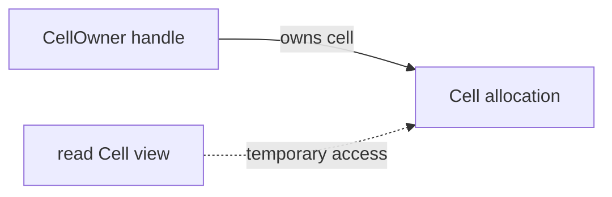

<!-- SPDX-License-Identifier: Apache-2.0 -->

# Ownership: a practical tutorial

Ownership answers two questions: who must clean up a value, and who can use it
before that cleanup? Crust checks these rules during compilation. An owner can
transfer a value. A borrower can use it for a shorter time. Destruction must
wait until conflicting uses have ended.

This tutorial teaches the ownership stage. It combines local owners and loans
with explicit domain access for opaque containers. The
[stage contract](ownership-model.md) defines the rules used by the examples.

Container implementations require explicit root-selected trust; their clients
use checked interfaces.

Start here if you can already write a function and a record. You do not need
to know the compiler implementation or a proof language.

Read the sections in order:

1. [Select the stage and run a program](#1-select-the-stage-and-run-a-program).
2. [Give a value a cleanup action](#2-give-a-value-a-cleanup-action).
3. [Transfer ownership](#3-transfer-ownership).
4. [Borrow for reads or changes](#4-borrow-for-reads-or-changes).
5. [Return a borrowed field](#5-return-a-borrowed-field).
6. [Own a heap allocation](#6-own-a-heap-allocation).
7. [Use an opaque container](#7-use-an-opaque-container)
8. [Defer a call](#8-defer-a-call)
9. [Choose the boundary](#9-choose-the-boundary)

The [Rust comparison](ownership-rust.md) explains corresponding concepts,
differences in accepted code, and obligations for container authors.

The [stage contract](ownership-model.md) gives the declaration and checking rules.

## 1. Select the stage and run a program

Run these commands from the repository root:

```sh
make all ownership-stage
build/crust examples/ownership-basics/main.crs
build/ownership-basics
```

The output is `BC`
and a newline. The [root file](../examples/ownership-basics/main.crs) loads the
ownership stage and compiles [program.crs](../examples/ownership-basics/program.crs).

To check a target file without producing an executable:

```sh
build/crust examples/ownership-basics/main.crs --check \
    examples/ownership-basics/program.crs
```

The root can also compile a copy of the target file. Pass `-o OUTPUT FILE` in
place of `--check FILE`. Target paths on this command line are relative to your
working directory.

The raw seed has no ownership guarantee. Selecting this stage is part of the
program's safety contract. The [resource stage tutorial](../stages/resources/README.md)
describes a different selection: local cleanup and `defer`, with raw memory
operations inside explicit `unsafe` adapters. Do not combine its guarantees
with this stage's guarantees without selecting and checking that composition.

## 2. Give a value a cleanup action

A `resource` is a record with automatic cleanup. The example uses a small
resource whose destructor prints one character:

```crust
resource Ticket { code: i32; } drop ticket_drop;

fn ticket_drop(ticket: mut Ticket) -> unit {
    var result: i32 = emit(ticket.code);
    if result < 0i32 { trap; }
}
```

The complete file declares `emit` as the C `putchar` function with a scalar-only
foreign contract. This printing action makes cleanup visible. A real resource
can instead release an allocation or another native resource. Its fields can
hold integer handles, such as file descriptors or API object identifiers.
`resource` assigns cleanup to the wrapper value. `owns(field)` also checks
ownership of a native handle. `owns(field: storage)` adds allocation ownership.

A local such as `ticket` owns one `Ticket` value. The type defines its cleanup;
the owning local determines when cleanup runs. `mut Ticket` gives the destructor
access to the value without creating a second owner. Section 4 explains this
borrowed type.

Unless stated otherwise, the following statement examples replace the body of
`main` in `program.crs`. Add `return 0i32;` at the end. Other declarations in
that file supply the helpers.

```crust
{
    var first: Ticket = make Ticket { code: 65i32 };
    var second: Ticket = make Ticket { code: 66i32 };
}
```

The block prints `BA`. Local resources drop in reverse declaration order.
Normal returns also run applicable cleanup. This stage rejects `break` and
`continue` because their ownership-state joins are not implemented.
A process exit or `trap` does not unwind scopes. RAII is the name for this
association between a value's lifetime and its cleanup.

Use `drop` to perform cleanup before scope exit:

```crust
var ticket: Ticket = make Ticket { code: 65i32 };
drop ticket;
ticket = make Ticket { code: 66i32 };
```

This prints `AB`: the first value drops explicitly, and the replacement drops
at scope exit. There is no second cleanup of the consumed value. A `record`
with only scalar fields has no cleanup action; reading an integer copies it.

### Own a native handle

The ownership rules apply to integers and opaque pointers. A file descriptor
uses an integer representation:

```crust
resource File { fd: i32; } owns(fd = -1i32) drop file_drop;
extern fn acquire_fd(fd: i32) -> i32 foreign(acquire File.fd) = "dup";
extern fn close_fd(fd: i32) -> i32 foreign(move fd: File.fd) = "close";

fn file_drop(file: mut File) -> unit {
    if file.fd != -1i32 {
        var status: i32 = close_fd(move file.fd);
        if status != 0i32 { trap; }
    }
}

fn file_new() -> File {
    var fd: i32 = acquire_fd(1i32);
    return make File { fd: move fd };
}
```

`owns(fd = -1i32)` defines an owned field with an invalid value of `-1`.
`acquire File.fd` returns a fresh owner or that invalid value. The acquired
integer cannot be copied into another owner. `move` transfers it to the field.
The destructor checks the invalid value before it consumes the handle. This
example traps if closing fails. That is the wrapper's explicit error policy.
The native close contract consumes the handle even if it reports an error.

A native operation can borrow a handle and acquire another in the same call:

```crust
extern fn duplicate(fd: i32) -> i32
    foreign(read fd: File.fd, acquire File.fd) = "dup";
```

Check `file.fd != -1i32` before `duplicate(file.fd)`. `read` permits shared use
for the duration of the native call. `mut` requires exclusive use. Neither
permits the native function to retain access after return. Ordinary source
helpers borrow `read File` or `mut File` and return or consume `File` values.

The [complete example](../examples/ownership-basics/handles.crs) also declares
`Stream.handle: *u8` with `owns(handle = null(*u8))`. It uses the same acquisition,
move, borrow, and cleanup rules. The pointer is opaque: it grants no permission
to dereference, reinterpret, or free memory. Memory owners use the additional
`storage` contract in section 6.

Raw integers cannot initialize these owned fields, even when their bits equal
a live descriptor. Different owned-field declarations identify different
resource kinds. To contain an existing kind, embed its resource wrapper.
A plain `fd: i32` field without `owns` remains copyable; cleanup alone does not
check the underlying native ownership.

Foreign effect declarations are trusted. The native implementation must obey
them. The checker rejects source violations of those contracts but cannot prove
a native library's implementation. A function with a scalar-only contract
cannot receive an owned handle. This prevents accidental loss of ownership
through an unannotated call.

The wrappers contain their declared integer or pointer handles. The foreign
calls keep their original C ABI. Failure tests use the declared integer or null
literal with `==` or `!=`.

## 3. Transfer ownership

Use `move` when another local or function must take responsibility for cleanup:

```crust
var first: Ticket = make Ticket { code: 65i32 };
var second: Ticket = move first;
```

This prints `A` once when `second` leaves scope. `first` is no longer usable.
A move transfers the value; it does not clone the owned resource or increase
a reference count.

**Rejected: copying a resource.**

```crust
var first: Ticket = make Ticket { code: 65i32 };
var second: Ticket = first;
```

Two cleanup obligations would refer to one resource. Add `move` if the second
local must own it. Use a borrow if both pieces of code need temporary access.

Resource moves consume a whole local owner. Moving an embedded resource, such
as `move h.inner`, would leave its owner's cleanup without an initialized
field. The diagnostic says that cleanup requires the whole owner. Borrow the
field for temporary access, or move its containing owner.

**Rejected: using a moved value.**

```crust
var first: Ticket = make Ticket { code: 65i32 };
var second: Ticket = move first;
drop first;
```

Remove the last line. `second` now owns the cleanup obligation. A by-value
resource parameter transfers the same obligation to the callee; a resource
result transfers it back to the caller. The caller uses the signature to check
this transfer. It does not inspect the function body.

## 4. Borrow for reads or changes

A *loan* is the compiler's record of a borrow. A `read T` view permits reads.
A `mut T` view permits exclusive changes. Borrowing does not transfer cleanup.
The source spells both the requested borrow and the parameter type:

```crust
fn set_code(ticket: mut Ticket, code: i32) -> unit {
    ticket.code = code;
}
```

A borrowed resource remains owned by the caller. `move ticket` reports
`cannot move out of a borrowed value`; `drop ticket` reports
`cannot drop a borrowed value`. To transfer cleanup to the function, take a
`Ticket` by value and pass it with `move`.

Call it with `set_code(mut ticket, 66i32)`.
The view uses ordinary field access. A borrowed scalar also uses its name
directly: write `view = 7i64`, rather than `*view = 7i64`.

Several shared views can coexist. An exclusive view excludes conflicting
reads and writes through other access paths. A named view lasts to the end
of its lexical scope, even if its last read occurs earlier.

**Rejected: changing a value while a named shared view is in scope.**

```crust
var count: i64 = 1i64;
var view: read i64 = read count;
if view != 1i64 { trap; }
count = 2i64;
```

**Correction: end the view's scope before the change.**

```crust
var count: i64 = 1i64;
{
    var view: read i64 = read count;
    if view != 1i64 { trap; }
}
count = 2i64;
```

Use the same repair before moving or destroying a borrowed owner. Copying a
scalar out of a view does not keep that view alive. A pointer or another
borrowed view still depends on the original storage.

A reborrow temporarily borrows through an existing view:

```crust
var count: i64 = 0i64;
{
    var view: mut i64 = mut count;
    { var child: mut i64 = mut view; child = 3i64; }
    view = 7i64;
}
if count != 7i64 { trap; }
```

The parent view cannot be used while a conflicting child view remains live.
In this example, the inner block ends before `view = 7i64`.

## 5. Return a borrowed field

A function can return a view if its signature states where the view comes from:

```crust
fn ticket_code(ticket: read Ticket) -> read i32 from ticket.code {
    return read ticket.code;
}
```

`from ticket.code` binds the result to that input field. It does not extend
the input's lifetime. The function body must return a view that satisfies this
relationship. A view of a local temporary or a different input is rejected.

```crust
var ticket: Ticket = make Ticket { code: 65i32 };
{
    var code: read i32 = ticket_code(read ticket);
    if code != 65i32 { trap; }
}
drop ticket;
```

The block ends before `drop ticket`. A helper that returns `mut T` needs
an exclusive input and a matching result origin. A node view uses the same
syntax. The [intrusive tutorial](../examples/intrusive/README.md#traverse-and-borrow-payload)
shows scoped cursors and payload views behind an opaque interface.

### Store views in a record

Use a view record when a helper needs to retain borrowed access:

```crust
record Editing { value: mut i64; }

fn editing_new(value: mut i64) -> Editing from value {
    return make Editing { value: mut value };
}

fn editing_set(view: mut Editing, value: i64) -> unit { view.value = value; }
```

`view.value = value` writes the borrowed integer. It does not replace the
reference. The caller keeps the source alive and excludes conflicting access:

```crust
var count: i64 = 1i64;
{
    var view: Editing = editing_new(mut count);
    editing_set(mut view, 7i64);
    var moved: Editing = move view;
    drop moved;
    count = 9i64;
}
```

The move transfers the held loan. `drop moved` ends that loan; it does not
destroy `count`. Ending the block has the same effect. A record with `read`
fields uses the same move rule, but permits shared access to its targets.
A shared loan of an `Editing` record also permits only reads of `value`.

**Rejected:** moving the view outside its source scope, copying it without
`move`, or changing `count` while the mutable view remains active. Keep the
view in a smaller scope, or drop it before direct access to the source.

The result contract names one exact origin for every borrowed result field.
A helper cannot return a view of a local variable or replace stored origins
through a borrowed record. Use a fresh result with `from` instead. View records
are scoped values; persistent graph links belong inside an explicitly trusted opaque implementation.

Run [views.crs](../examples/ownership-basics/views.crs) with the
[example instructions](../examples/ownership-basics/README.md#stored-views).
It also shows nested records and returned loans through stored fields.
`Comparison` combines independent factory results in a local record. To change
a local view's source, drop the old view and assign a new factory result:

```crust
var first: i64 = 1i64;
var second: i64 = 2i64;
var view: Editing = editing_new(mut first);
drop view;
view = editing_new(mut second);
first = 3i64;
drop view;
second = 4i64;
```

Each assignment uses the existing single-origin factory interface. No
replacement-origin contract is needed for a local whose old loan has ended.

## 6. Own a heap allocation

For heap storage, a resource can own the allocation addressed by a pointer
field. The [heap example](../examples/ownership-basics/heap.crs) declares the
handle and its allocation separately:

```crust
domain Cells(Cell, CellOwner);
record Cell { value: i64; }
resource CellOwner { cell: *Cell; } owns(cell: storage) drop cell_drop;
```

`owns(cell: storage)` gives the handle responsibility for that allocation.
`domain Cells(Cell, CellOwner)` assigns both types to `Cells`, an access domain:
a compile-time name that groups storage and its access rules. Each type can
belong to one domain. Cleanup of an owner in this domain requires
reclamation permission. The constructor and destructor declare
`access(reclaim, Cells)`:

```crust
fn cell_new(value: i64) -> CellOwner access(reclaim, Cells) {
    var cell: *Cell = allocate(sizeof(Cell)) as *Cell;
    if cell != null(*Cell) { (*cell).value = value; }
    return make CellOwner { cell: move cell };
}

fn cell_drop(owner: mut CellOwner) -> unit access(reclaim, Cells) {
    var cell: *Cell = move owner.cell;
    if cell != null(*Cell) { release(cell as *u8); }
}
```

| Function contract | Permitted use of its domain |
| --- | --- |
| `access(read, Cells)` | Read through valid views. |
| `access(edit, Cells)` | Change valid storage and checked links. Preserve owners. |
| `access(reclaim, Cells)` | Create and destroy owners when conflicting uses have ended. |

Reclamation permission also permits read and edit calls. A function can narrow
its permission inside `read Cells { ... }` or `edit Cells { ... }`. The block
ends before the function recovers its outer permission. Owners must survive
until their views end. Domain permissions are compile-time facts; they add no
runtime object, pool, common allocation lifetime, or lock. Concurrent access
still requires synchronization.

The file declares `allocate` and `release` as foreign allocation and release
operations. Those declarations are trusted adapters to `malloc` and `free`.
They are not proof that arbitrary foreign code obeys the contract.

`sizeof(Cell)` supplies both the byte count and the record type whose fields
the checker tracks. `allocate(8usize)` supplies only a byte count, so it is
rejected even when `Cell` occupies eight bytes. Use `allocate(sizeof(Cell))`;
parentheses around the size expression are accepted. Checked allocation
requires a record type, including for a single scalar payload.

Direct allocation calls are restricted to bodies outside loops. To allocate
per iteration, call an owning constructor such as `cell_new` in the loop.
The checker uses its returned resource contract to track each owner and its
cleanup. An arbitrary byte buffer requires a trusted provider that supplies
its storage and access contracts.

The constructor returns a nullable owned field. Its caller checks allocation
failure before use. The destructor consumes the field and releases it once.
The stage rejects a missing release, a second release, or access after release.



The solid arrow denotes the cleanup obligation. The dashed arrow denotes a
loan. Neither arrow adds a field to the generated program. A view must end
before the owning handle is destroyed.

Run the example:

```sh
build/crust examples/ownership-basics/main.crs -o build/ownership-heap \
    examples/ownership-basics/heap.crs
build/ownership-heap
```

The output is `AB` and a newline. The first owner is destroyed before the
replacement is created. The allocator can reuse the address. A new allocation
does not make a cursor from the old allocation valid again.

## 7. Use an opaque container

The [intrusive tutorial](../examples/intrusive/README.md) contains a direct
pointer implementation and a checked client. The compilation root selects the
implementation as trusted. Checked code cannot access its private fields.

```crust
domain Graph {
    var owner: Owner = owner_new(65i64);
    var head: ReadyHead = uninit;
    ready_init(&head);
    ready_insert(mut head, read owner);
    read Graph {
        var cursor: Cursor = ready_first(read head);
        var value: read i64 = cursor_value(read cursor);
        if value != 65i64 { trap; }
    }
    drop owner;
}
```

The domain block creates a fresh compile-time identity. It adds no runtime
object. The head is constructed in its final stack location. Insertion borrows
the owner handle; the trusted container can retain the node pointer in that
domain. Node cleanup unlinks the node before release. Head cleanup detaches any
survivors. Each implementation must uphold these obligations.

Move `drop owner` inside `read Graph` and compilation fails: the destructor
requires reclamation access. Move `cursor` outside that block and compilation
fails: a scoped view cannot outlive its access. Holding a mutable payload view
also blocks other operations that could alias the payload. End that loan before
editing or navigating through a conflicting handle.

A fresh nested `domain Graph` is a different instance. An outer owner cannot
be inserted into its head. The compiler compares static identities, not pointer
bits. No node registry or generation check is required.

## 8. Defer a call

A deferred call captures its arguments now and executes at scope exit:

```crust
fn consume(ticket: Ticket) -> unit {}

fn later() -> unit {
    var ticket: Ticket = make Ticket { code: 65i32 };
    defer consume(move ticket);
}
```

The capture owns the ticket until `consume` runs. A borrowed capture keeps its
loan until the call runs. Later conflicting writes, moves, or destruction are
rejected. The required access permission must be available during cleanup.
Deferred calls return `unit`; wrap foreign calls in a checked source function.
In-place constructors cannot be deferred. Checked code cannot call or defer a
destructor function directly. Use `drop`, or defer a helper that consumes an
owner by value, as above. This prevents a second cleanup of the same resource.

## 9. Choose the boundary

Local ownership checks do not prove a raw graph algorithm. Use an opaque
library when internal aliases need that algorithm. Test its implementation with
native tests and sanitizers, and test its client interface with rejected programs.
The [owning tree](../examples/ownership-graphs/README.md) uses the same rules.
It transfers ownership through ordinary child links and returns an owner on
removal. The stage has no tree-specific rule.

The [one-way index](../examples/ownership-index/README.md) owns symbols and
separate aliases to them. A symbol has no reverse alias link. Its retirement
operation scans and clears incoming aliases before it frees the symbol.
The client uses the same read, edit, and reclamation scopes as the list.

Returned views state one exact input path with `from`. Stored views can combine
several local origins, but a returned view record currently requires all its
borrowed fields to use that one declared path. Split such results into separate
calls, or construct the combined view in the caller. Replacing origins through
a borrowed view record is rejected: its interface has no replacement map.
The index and stored-view examples exercise these forms. This profile keeps
the single-origin boundary and rejects interfaces that need an origin map.

Independent libraries retain the same types, effects, origins, and selected
trust in their receipts. See the [stage contract](ownership-model.md#independent-libraries).
The guarantee depends on the root selecting the checker and correct trusted
implementations. Selecting the raw seed provides raw-pointer semantics.
