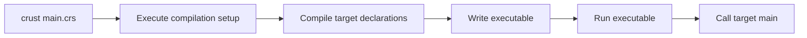
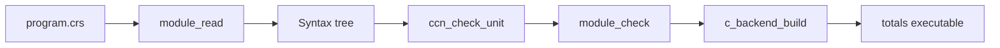

<!-- SPDX-License-Identifier: Apache-2.0 -->

# Getting started with Crust

A Crust source file can contain both your program and the code that builds it.
You choose the input files, language extensions, and backend with ordinary
function calls. A small project can start with a small compiler setup and add
checks or tools as it grows.

This tutorial starts with a greeting, introduces the core language, then adds a
compilation step. It assumes some experience with variables, functions, and
command-line tools. Run the shell commands from the repository root.

The core language is called Crust0. The *seed* is its C99 compiler and
evaluator, which start the compilation program. Compiler libraries written
in Crust supply the backends and language extensions used later in the guide.

## Build your first program

The current target is Linux x86-64. You need GCC, GNU Make, GNU binutils,
Python 3, and the libffi development headers and library.

```sh
make all c-stage
mkdir -p build/learn
```

`make` builds the launcher and prepares the C backend. The `build/learn`
directory will hold your source files and executables for this tutorial.

Save this as `build/learn/main.crs`:

```crust
host_source(run, "../../api/crust0_stage.crs");
host_source(run, "../../stages/c/api.crs");
host_source(run, "../../stages/c/build.crs");
host_link(run, "../../build/crust-c-library.so");

var arguments: [*u8; 2] = make [*u8; 2] {
    "-o", host_path(run, "hello")
};
return c_build((*run).source, (*run).cursor, 2i32, &arguments[0usize]);

extern fn puts(text: *u8) -> i32 = "puts";

fn main(argc: i32, argv: **u8) -> i32 {
    if puts("Hello, world!") < 0i32 { return 1i32; }
    return 0i32;
}
```

Build and run it:

```sh
build/crust build/learn/main.crs
build/learn/hello
```

The first command runs the compilation program and creates the executable.
The second command runs that executable and prints `Hello, world!`.

The part through `return c_build(...)` sets up compilation. The declarations
after it form the target program. `c_build` receives the remaining source,
compiles it, and returns a status. The C backend produces C code and calls GCC
and the native linker to make the executable.



The target entry is `fn main(argc: i32, argv: **u8) -> i32`. Its parameters
contain the executable's argument count and argument strings. A zero result
reports success. The `extern fn` declaration connects `puts` to the function
with that name in the system C library.

Try changing the greeting and running the two commands again.

## Values, functions, and control flow

Keep the compilation setup. Replace everything after its `return c_build(...)`
statement with this target program:

```crust
extern fn puts(text: *u8) -> i32 = "puts";

record Totals {
    sum: u64;
    count: usize;
}

fn twice(value: u64) -> u64 {
    return value * 2u64;
}

fn add(totals: *Totals, value: u64) -> unit {
    (*totals).sum = (*totals).sum + value;
    (*totals).count = (*totals).count + 1usize;
}

fn main(argc: i32, argv: **u8) -> i32 {
    var values: [u64; 4] = make [u64; 4] { 1u64, 2u64, 3u64, 4u64 };
    var totals: Totals = make Totals { sum: 0u64, count: 0usize };
    var transform: fn(u64) -> u64 = twice;
    var index: usize = 0usize;

    while index < 4usize {
        add(&totals, transform(values[index]));
        index = index + 1usize;
    }

    if totals.sum != 20u64 || totals.count != 4usize { return 1i32; }
    if puts("Four values, doubled: total 20.") < 0i32 { return 1i32; }
    return 0i32;
}
```

Build and run with the same commands. The output is:

```text
Four values, doubled: total 20.
```

### Types are written at each declaration

`var index: usize = 0usize;` declares a mutable local. The type after the colon
belongs to the variable. The suffix on `0usize` gives the literal its type.
Function parameters, results, and record fields also have explicit types.

Use `i8`, `i16`, `i32`, and `i64` for signed integers, and their `u` forms for
unsigned integers. `usize` and `isize` have the target pointer width.
`bool` holds `true` or `false`. `unit` is the result type of a function that
returns through `return;` or reaches the end of its body, such as `add`.

Arithmetic operands must have matching types. To change an integer's type,
write the conversion:

```crust
var small: u8 = 7u8;
var wide: u64 = small as u64;
```

For example, adding `small` directly to `wide` produces a type error. Writing
`(small as u64) + wide` makes the conversion explicit. Integer casts keep the
low bits when the destination is narrower.

Integer addition, subtraction, and multiplication wrap at the type's width.
Division by zero, signed division overflow, and invalid shift counts trap.
Comparisons produce `bool`, the type required by `if` and `while`.

### Functions use ordinary values

`twice` takes a copy of one integer and returns an integer. `add` takes a
pointer so that it can change the caller's `Totals` record.

The declaration `var transform: fn(u64) -> u64 = twice;` stores a function
value. Calling `transform(...)` uses its declared signature. You can pass
function values as arguments in the same way. Pass any associated state as a
separate parameter.

The core accepts scalar parameters and results: integers, booleans, pointers,
and function values. Pass a record or array through a pointer. Each function
name in a core declaration unit must be unique; the
[overload stage](../stages/overload/README.md) supplies overload selection.

### Blocks give locals their scope

Braces contain statements. A local remains live through its enclosing block.
Choose distinct names for simultaneously visible locals and declarations.

`while` tests its condition before each iteration. `break;` leaves the nearest
loop, and `continue;` returns to that loop's condition. `if` can have an `else`
block or an `else if` branch. A function with a value result needs a return on
every path that reaches the end of its body.

Expressions evaluate from left to right, including function arguments. `&&`
evaluates the right side when the left side is true; `||` evaluates it when
the left side is false. These rules let you put a pointer check before an
access in the same condition.

Use `//` for a comment through the end of the line. Statements such as variable
declarations, assignments, and returns end with a semicolon.

## Records, arrays, and addresses

`record Totals` defines a type with named fields. `make Totals { ... }` supplies
each field's initial value. Access a field with `totals.sum`.

`[u64; 4]` is a fixed array with four elements. The array count is a decimal
number in the type; an index expression has type `usize`. The `make` expression
supplies exactly four values. The loop keeps `index` in the range from zero
through three.

Assigning a record or array copies its value. For example, insert this after
the loop:

```crust
var saved: Totals = totals;
saved.sum = 99u64;
```

`saved` now has its own fields. `totals.sum` remains 20. A copied pointer field
continues to refer to the same storage as the original pointer.

`&totals` takes the record's address and has type `*Totals`. Inside `add`,
`*totals` refers to the record at that address. `(*totals).sum` selects its
`sum` field. The caller's local remains live while `add` runs.

For a pointer `p: *T`, `p[index]` accesses an element with a `usize` index.
`p + offset` advances by elements with an `isize` offset. When passing an array
to a function, use `&values[0usize]` and pass its length separately.
`null(*Totals)` constructs a null pointer of the given type.

Core pointer operations require live, aligned storage and an access that fits
inside it. Reads require initialized values, and writes require writable
storage. The program must keep those conditions true for every access.
The [ownership stage](ownership.md) checks additional lifetime and access
rules through declared interfaces.

### Constants and layout

Use a top-level `const` for immutable static data:

```crust
const LIMIT: u64 = 20u64;
const LABEL: *u8 = "total";
const TOTAL_BYTES: usize = sizeof(Totals);
```

Constant initializers support literals, function names, layout queries, and
record or array construction from those forms. Perform computed setup in a
function or in the compilation program.

Fields occupy storage in declaration order, with padding for alignment.
`sizeof(Totals)` gives the record size, `alignof(Totals)` gives its alignment,
and `offsetof(Totals, count)` gives a field's byte offset. All three return
`usize` values for the selected target.

A string literal has type `*u8` and points to static, read-only bytes followed
by a zero byte. `"line\n"` includes a line feed; `"quote: \""` includes a
double quote. This representation works directly with the `puts` declaration
in the example.

`uninit` reserves a local's storage for later initialization. You will see it
in compiler setup code followed by an initialization function. Complete that
initialization before reading the value. For ordinary data, start with a
literal or `make` expression as above.

## How the compilation program runs

Now return to the first lines of `main.crs`. The launcher supplies
`run: *CrustRun`, which holds the source, current position, arguments, and
reader and executor functions.

The default runner reads one complete action, checks it, and executes it.
Then it reads the next action. A declaration, assignment, or function call can
be an action. Root variables retain their storage through root execution.

A root `return` finishes execution with an `i32` status from 0 through 255.
Reaching the end of the source also completes root execution. Builds, tool
calls, and waits for jobs happen at their explicit call sites. If an action
fails, the effects of earlier completed actions remain.

The setup uses these helpers:

| Call | Effect |
| --- | --- |
| `host_source(run, path)` | Read and check a whole file of declarations for the compilation program |
| `host_link(run, path)` | Load a shared library containing native functions |
| `host_path(run, path)` | Resolve a path relative to the root source file |
| `c_build(source, begin, argc, argv)` | Compile the selected target source with the C backend |

The first three loaded source files declare the build request, C backend calls,
and `c_build` helper. The shared library supplies the compiled backend.
The launcher already supplies the core compiler and host interfaces.

`(*run).source` points to the root's captured source bytes. `(*run).cursor`
is the byte offset just after the current action. By the time the final
`return c_build(...)` executes, the cursor is past its semicolon. That is where
the helper starts reading the target declarations. Keep this cursor access
in the action that hands the remaining source to the target compiler.

The root and target have separate compiler contexts and names. Give target
declarations to the target build, and load compilation helpers with
`host_source`. Within a whole declaration unit, functions can call functions
defined later in that unit. A function declared directly in the streamed root
can use itself and earlier declarations. Pass root variables to such a function
as explicit parameters.

A root block, `if`, or `while` has a final semicolon after its closing brace:

```crust
var repetitions: usize = 0usize;
while repetitions < 3usize {
    repetitions = repetitions + 1usize;
};
```

The semicolon marks the complete action's boundary. Inside a function, a block
ends at its closing brace. This boundary becomes useful when an action changes
the reader for the following source.

### Paths and arguments

Our root lives in `build/learn`, so `../../api/crust0_stage.crs` reaches the
repository's `api` directory. `host_path(run, "hello")` selects an output next
to the root. Paths passed directly to a backend as plain argument strings are
relative to the process working directory.

The launcher places arguments after the root path in `(*run).argc` and
`(*run).argv`. To let the command line select the output and other C backend
options, replace the argument array and build call with:

```crust
return c_build((*run).source, (*run).cursor, (*run).argc, (*run).argv);
```

Then use:

```sh
build/crust build/learn/main.crs -o build/learn/totals
build/learn/totals
build/crust build/learn/main.crs --check
build/crust build/learn/main.crs --emit-c -o build/learn/totals.c \
    --symbols build/learn/totals.rsp
```

`--check` stops after the frontend checks. `--emit-c` writes C and a symbol
mapping for inspection or later compilation. The root decides which arguments
to forward. The [C backend tutorial](../stages/c/README.md) explains the
remaining options and the symbol mapping.

## Put the target in its own file

Move the target declarations into `build/learn/program.crs`. Keep the first
four setup calls in `main.crs` and replace the rest of that file with:

```crust
var target: *CrustSource = host_input(run, "program.crs", 1u64);
if target == null(*CrustSource) { return 1i32; };
var arguments: [*u8; 2] = make [*u8; 2] {
    "-o", host_path(run, "totals")
};
return c_build(target, 0usize, 2i32, &arguments[0usize]);
```

Run `build/crust build/learn/main.crs`, then `build/learn/totals`.
`host_input` captures the target bytes. The `1u64` argument supplies their
source identity. The zero begin offset selects the complete target file.

The C backend accepts additional source paths in its argument array. The
[multiple-file example](../examples/multiple-files/README.md) shows two target
files sharing one namespace. When you need separate namespaces and selected
exports, the [module tutorial](../stages/modules/README.md) shows how to build
them through the compiler API. Its provider supplies declaration and type
facts that the consumer uses to check calls.

## Add a compilation stage

Suppose you want to keep functions small enough to inspect easily. A stage
can count decisions in each function and stop the build when a count exceeds
your project's limit.

A *stage*, or *metastage*, is code that performs compiler work. Here the stage
walks a parsed syntax tree. It needs the tree and a limit; the root chooses
when to call it.

Keep `program.crs` from the previous section. Replace `main.crs` with:

```crust
host_source(run, "../../api/crust0_stage.crs");
host_source(run, "../../stages/c/api.crs");
host_source(run, "../../stages/modules/library.crs");
host_source(run, "../../stages/ccn/count.crs");
host_link(run, "../../build/crust-c-library.so");

const COMPLEXITY_LIMIT: usize = 8usize;

fn build_checked(root: *CrustRun, target: *CrustModule) -> i32 {
    var input: *u8 = host_path(root, "program.crs");
    var output: *u8 = host_path(root, "totals");
    if input == null(*u8) || output == null(*u8) { return 1i32; }
    if !module_read(target, input, 1u64) { return 1i32; }

    var counter: CcnCounter = uninit;
    ccn_init(&counter, &(*target).context);
    if !ccn_check_unit(&counter, (*target).context.units, COMPLEXITY_LIMIT) {
        return 1i32;
    }
    if !module_check(target) || !module_export(target, "main", "tutorial_main") {
        return 1i32;
    }

    var options: CBackendOptions = make CBackendOptions {
        mode: 0u32, output: output, symbols: null(*u8),
        cflags: null(**u8), cflag_count: 0usize,
        ldflags: null(**u8), ldflag_count: 0usize
    };
    return c_backend_build(&(*target).context, module_find(target, "main"), &options);
}

var target: CrustModule = uninit;
module_init(&target, null(*CrustAllocator));
var status: i32 = build_checked(run, &target);
if target.context.error_count != 0usize { crust_run_diagnostic(&target.context); };
module_destroy(&target);
return status;
```

Build and run with the same two commands. Then change `COMPLEXITY_LIMIT` to
`1usize` and build again. The compiler reports that `main` exceeds the limit
and returns a failure status. Restore the limit to continue.

The [complexity tutorial](../stages/ccn/README.md) explains the count. It starts
at one and adds one for each `if`, `while`, `&&`, and `||` in a function.

### Follow the data through the stages

`CrustModule` owns a compiler context. `module_read` fills that context with
parsed declarations and their source positions. `ccn_check_unit` examines those
declarations. `module_check` resolves names and types and checks function bodies.
The backend receives the checked context and selected entry function.



The context owns the nodes and tables used during this work. The root creates
it before reading and destroys it after the build finishes. This example keeps
cleanup in the root so that every return from `build_checked` reaches it.
`mode: 0u32` selects an executable, and the empty flag arrays select the
backend's default tool options.

The same approach works for other checks. Choose the representation that has
the facts your check needs. A complexity check can use written syntax. A check
on argument types needs resolved types. Ownership checking needs source-level
ownership and borrow information before lowering converts those values to
their runtime representation.

Compiler construction functions and types are declared in
[api/crust0.crs](../api/crust0.crs). The
[design guide](design.md#extension-points) lists the extension points and
working examples. A backend or frontend can also define its own representation
with ordinary Crust records.

## Select language extensions

An extension can add syntax and rules as well as inspect a tree. The root
selects its reader, checks, lowering, and emission code. This selection is part
of the program's compilation setup.

For a small ownership example, save this as `build/learn/borrow.crs`:

```crust
fn main(argc: i32, argv: **u8) -> i32 {
    var count: i64 = 1i64;
    {
        var view: read i64 = read count;
        if view != 1i64 { return 1i32; }
    }
    count = 2i64;
    return 0i32;
}
```

Select the ownership stage with its supplied root:

```sh
make ownership-stage
build/crust examples/ownership-basics/main.crs \
    -o build/learn/borrow build/learn/borrow.crs
build/learn/borrow
```

`read count` creates a shared loan. The inner block sets the loan's lifetime.
After that block ends, the assignment to `count` is permitted. Try placing
`count = 2i64;` inside the block after the declaration of `view`: the stage
rejects the write while the shared loan is live.

The ownership stage also provides `move`, mutable loans, and resources with
cleanup functions. Resource cleanup follows scope exits and normal returns;
`defer` schedules a call at scope exit. These checks run during compilation.
The generated program contains the selected operations and cleanup calls.
The [ownership tutorial](ownership.md) develops these ideas through file
handles, heap allocations, and container clients.

Each extension has its own compilation entry point. For example, the
[overload tutorial](../stages/overload/README.md) uses `overload_build` to
select functions by their argument types and assign native names. The
[combined example](../examples/overload/resources/README.md) shows the order
needed to combine overload selection with resource checking and cleanup.

The [generics tutorial](../examples/generics/README.md) declares a shared pair
as `record Pair!(Element)` and uses it as `Pair!(Position)` and `Pair!(Sample)`.
Functions declare their own parameters and use explicit arguments such as
`pair_swap!(Position)(&pair)`. The root selects the stage and input files;
definitions and applications stay in those files. The stage emits concrete
records and functions.

## Change the syntax of later source

The root's `read`, `execute`, and `user` fields select how to read and execute
its next action. A reader can accept a different grammar and return an action
for its paired executor.

Run the existing reader example:

```sh
build/crust examples/reader-switch/main.crs
```

It prints:

```text
Hello from a reader written in CRUST!
These lines use the new grammar.
```

The [source](../examples/reader-switch/main.crs) defines `read_line` and
`write_line` using ordinary Crust functions. Its final setup action is:

```crust
var line: Line = uninit;
{
    (*run).user = &line as *u8;
    (*run).read = read_line;
    (*run).execute = write_line;
};
> Hello from a reader written in CRUST!
> These lines use the new grammar.
```

The block installs both functions together. Its final semicolon marks the
transition. `read_line` receives the following bytes, accepts a line starting
with `> `, and advances the cursor. `write_line` prints the resulting text.
The `Line` value holds their shared state and stays live through execution.

The runner captures the reader, executor, and user pointer before each action.
That pair completes the action; updated fields select the pair for the next
one. The current action has already been read when it executes. Changes to
the reader take effect at the next action boundary.

For additions to the target declaration grammar, the
[Crust reader library](../stages/reader/README.md) offers hooks for declarations,
statements, prefix expressions, and types. The resource and overload stages
use this library. Choose these hooks when extending Crust syntax, or select
a complete reader for an input language of your own.

## Prepare backends and run compilation code natively

The examples above load a C backend prepared by `make c-stage`. The root
evaluates its setup calls, and calls into that backend run native code.
The assembly backend is another Crust library; it produces x86-64 assembly
for the GNU assembler. The backend you choose must support the operations
and stage output used by your target.

A root can also build its compiler stages from source. The
[native execution tutorial](../stages/native/README.md) prepares a library,
then installs an executor that compiles and runs subsequent function actions.
Those functions keep access to state supplied by the earlier root setup.

The [cached backend tutorial](../examples/cached-backend/README.md) starts with
the C99 seed and stage sources. Its setup interprets an assembly emitter to
produce a native library. Later compilation actions use the resulting native
code. On another invocation, the cache can supply that library after checking
its inputs and contents.

This separates three useful costs: preparing the compiler tools, compiling
your application's source, and running the native assembler or C toolchain.
The [benchmark guide](../benchmarks/README.md) records those boundaries.

For larger builds, the [parallel stage](../stages/parallel/README.md) runs
explicit native jobs with separate mutable state. Publish the interfaces
needed by consumers before starting those consumers. Keep shared source and
interface storage live until their jobs finish. The root chooses the
dependencies and the point where it waits for results.

## Where to go from here

- [Tutorials and examples](../examples/README.md) has complete programs to copy
  and modify, including modules, highlighting, ownership, and intrusive lists.
- The [language specification](crust0-spec.md) gives exact type, arithmetic,
  storage, and calling rules.
- The [source runner contract](source-runner.md) describes action boundaries,
  callbacks, source identities, and their lifetimes.
- The [bootstrap guide](bootstrap.md) covers builds, tests, and the C99 seed.
