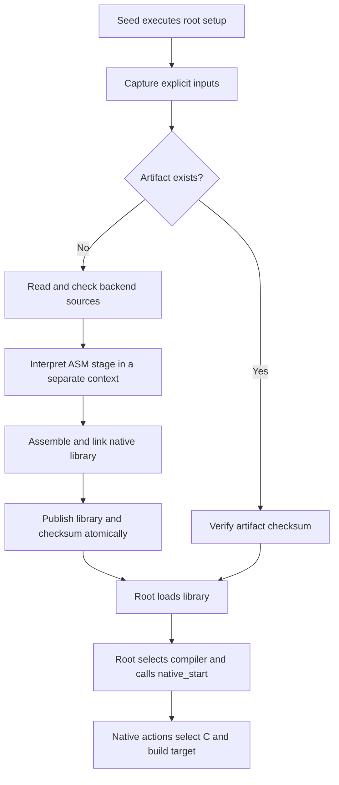

<!-- SPDX-License-Identifier: Apache-2.0 -->

# Bootstrap and cache a backend

[main.crs](main.crs) starts with the backend-free C99 seed and Crust source.
An early root action prepares an ASM/C backend library. It then loads that
library and gives the following compilation functions to its native executor.
A later run can reuse the library.

```sh
make build/crust
build/crust examples/cached-backend/main.crs
build/cached-hello
build/crust examples/cached-backend/main.crs
```

No prepared backend is required. Use a Linux x86-64 system with GNU assembler,
GNU linker, GCC, `objcopy`, `sha256sum`, and `ldd`. The target prints
`Hello from a bootstrapped native stage!`.

## Follow the source

The root loads the ordinary [cache stage](../../stages/cache/README.md), native
execution helpers, and [build recipe](build.crs). It captures its listed source
files, retained producer source snapshots, root code, seed executable, loaded
libraries, and native tools. The root
code includes the source counts and export selection; the recipe includes the
fixed tool arguments. These bytes determine the artifact key.



The miss path uses a second `CrustRun` and its evaluator to call the source
assembly emitter. Its checked declarations and callbacks stay live through
emission. It destroys that evaluator before its context. The emitted file
contains target symbols and relocations, never evaluator addresses.

The linker receives the captured libc file. This binds versioned system
symbols to the selected ABI. An unversioned `realpath` reference can select an
older ABI that rejects a null output buffer. The resulting library depends
on libc and the runner's public C API. It has no temporary stage dependency.

## Keep selection and lifetime explicit

The cache call returns a path. The root calls `crust_run_link`, assigns
`session.compile`, and calls `native_start`. These are separate source actions;
a cache hit does not install operations or run an old root result.

The native executor links each following action against `session.libraries`
and preceding action images. The root retains its counter and interpreted
callback. Two native actions check their addresses and copied function values.
The root checks the state again after native execution. These checks run on
both hits and misses.

Temporary action files are removed after execution. The root owns loaded code
until runner destruction. Published cache files remain available for later
invocations and link operations. Remove `build/backend-cache` only after users
of that directory have finished.

## Change an input and measure

Edit a stage source or recipe, then run the root again. The changed bytes select
a new entry. Source order and input membership also affect the key. The cache
uses captured source bytes even if their original files change after capture.
The native tools and libraries must stay unchanged while the request runs.

```sh
make check-cache
make all c-stage
python3 benchmarks/backend-cache/measure.py --rounds 20 --output build/cache-measurement.json
```

The measurement uses fresh processes and randomizes endpoint order. It compares
misses, hits, and prepared backends, checks emitted bytes, and runs the final
list program. It excludes final target GCC compilation and linking. Native
stage preparation remains in the miss result. Reports stay under `build/`.
A warm result does not establish the cold C-speed requirement.
