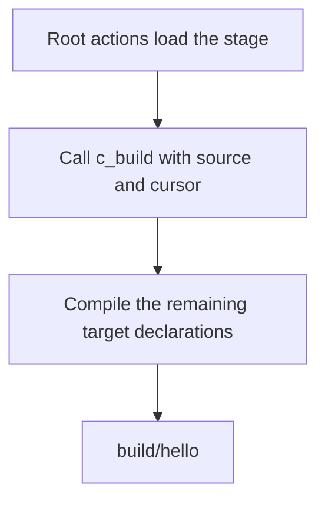

<!-- SPDX-License-Identifier: Apache-2.0 -->

# Tutorial: Hello World in one file

This example contains two programs in [main.crs](main.crs). The first program
controls compilation. The second program prints a greeting. You will build
the file, follow the boundary between these programs, and change the output.

The compilation program uses ordinary Crust calls. It selects the C backend,
passes source text to it, and sets an output path. This is the same mechanism
that later tutorials use to select overloads and ownership rules.

## Build and run

Use Linux x86-64 with Make, GCC, and binutils. Run these commands from the
repository root. The [bootstrap guide](../../docs/bootstrap.md) describes
the build tools in more detail.

```sh
make all c-stage
build/crust examples/hello/main.crs
build/hello
```

The last command prints this line and returns zero:

```text
Hello, world!
```

`make` prepares the launcher and compiler library. `build/crust` executes the
compilation program, which produces `build/hello`. Only the last command runs
the target program.

This build uses the C backend and includes GCC compilation and linking.
GCC work can dominate its total time. The frontend speed gate excludes those
steps; the [complete-build benchmark](../../benchmarks/build-time/README.md)
compares complete C and assembly builds of the intrusive-list example.

## Read the compilation program

The first four lines load declarations, a helper, and compiled stage code:

```crust
host_source(run, "../../api/crust0_stage.crs");
host_source(run, "../../stages/c/api.crs");
host_source(run, "../../stages/c/build.crs");
host_link(run, "../../build/crust-c-library.so");
```

The launcher supplies `run`, a pointer to the current root execution state.
It also supplies the core compiler and host interfaces. Do not load those
interfaces again. The first added file declares the target build request.
The second declares the C backend calls. The third defines `c_build`, which
creates and releases a target compiler context for one build.

`host_source` reads and checks a complete declaration unit. `host_link` loads
an ordinary shared library for native calls. The runner does not recognize
the backend by its name or path. Its public declarations and compiled code
must agree.

The next lines select the target output and start compilation:

```crust
var arguments: [*u8; 2] = make [*u8; 2] {
    "-o", host_path(run, "../../build/hello")
};
return c_build((*run).source, (*run).cursor, 2i32, &arguments[0usize]);
```

`[*u8; 2]` is an array of two string pointers. The helper receives an
argument count and a pointer to the first element. There is no executable
name in this argument array. `2i32` and `0usize` are explicitly typed integer
literals.

Paths passed to `host_source`, `host_link`, and `host_path` start at the root
file's directory. Thus `../../build/hello` selects the repository's build
directory. A plain path passed directly as `-o` would start at the process
working directory. `host_path` makes that distinction explicit.

## Find the source boundary

The runner reads one complete root action before it executes that action.
During the final `return`, `(*run).cursor` already points past its semicolon.
`c_build` receives that byte offset and compiles the rest of the source.



The comment `// The target program starts here.` is for the reader. It is
not a compiler directive. The cursor determines the boundary. Do not save
the cursor before the final action: it would include later compilation
instructions in the target input.

The target has its own compiler context and name scope. Loading an API into
the root does not declare that API in the target. Diagnostics still refer
to line numbers in the complete original file.

## Read the target program

```crust
extern fn puts(text: *u8) -> i32 = "puts";

fn main(argc: i32, argv: **u8) -> i32 {
    if puts("Hello, world!") < 0i32 { return 1i32; }
    return 0i32;
}
```

The external declaration gives the type and native link name of `puts`.
The C backend links the target with the system C library. `puts` appends a
newline. The target returns one if the call fails.

The hosted entry has type `fn(i32, **u8) -> i32`. It receives the target
argument count and argument array, even when the program does not use them.
The generated executable does not need the compiler library to run.

## Make a small change

Change the string inside the target `puts` call, then repeat:

```sh
build/crust examples/hello/main.crs
build/hello
```

The new executable must print your new string. The compilation program
does not need to change. To select a different output file, change the
string passed to `host_path` and run that new executable after compilation.
Restore the example after this exercise.

The root uses a fixed backend argument array. Adding options after
`examples/hello/main.crs` does not forward them to the backend. A root must
read `(*run).argc` and `(*run).argv` and choose how to use them. See the
[arguments example](../arguments/README.md) for that pattern.

Continue with the [C backend tutorial](../../stages/c/README.md) to inspect
the generated C and native symbols. The [runner contract](../../docs/source-runner.md)
defines the complete source execution and lifetime rules.
