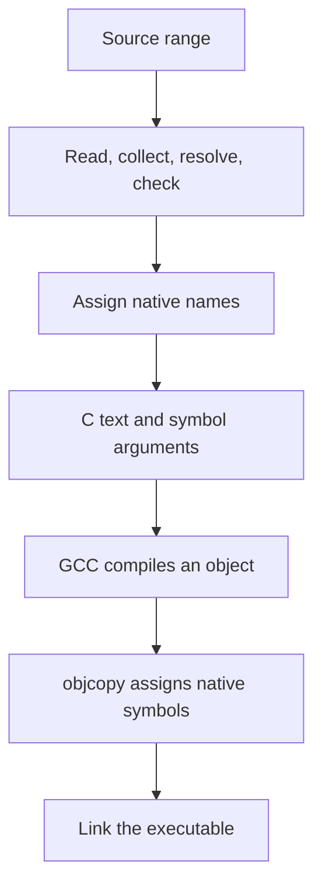

<!-- SPDX-License-Identifier: Apache-2.0 -->

# Tutorial: a C backend written in Crust

The C backend turns checked Crust operations into C text. GCC compiles that
text, and the driver links the result. The backend is an ordinary Crust
library selected by the compilation program.

This provides a small path from the bootstrap compiler to native programs.
Type mapping, expression lowering, text buffers, and driver policy live in
`.crs` files. The C99 seed still supplies compiler services, including its
reader and checker. Native host calls supply allocation, files, and process
execution. The backend does not call a hidden C emitter.

Start with [Hello World](../../examples/hello/README.md). This tutorial then
follows a call from source to C, builds that output by hand, and shows where
another stage can supply its own function bodies. Use the
[backend reference](../../docs/c-backend.md) for the full API and output contract.

## 1. Select the backend

Run from the repository root on Linux x86-64:

```sh
make all c-stage
build/crust examples/hello/main.crs
build/hello
```

The root loads [api.crs](api.crs), the helper [build.crs](build.crs), and
`build/crust-c-library.so`. Its final `c_build` call passes the unread source
range and an output argument array. The target prints `Hello, world!`.

The build also supplies `build/crust-c`, a command wrapper for the same
backend. It takes target declaration files directly. It does not execute
root setup actions. We will use it to inspect a small target without
changing the Hello World compilation program.

## 2. Make evaluation order visible

Create this target file:

```sh
mkdir -p build/tutorial-c
cat > build/tutorial-c/order.crs <<'EOF'
extern fn puts(text: *u8) -> i32 = "puts";

fn mark(text: *u8) -> i32 { return puts(text); }

fn both(left: i32, right: i32) -> i32 {
    if left < 0i32 || right < 0i32 { return 1i32; }
    return 0i32;
}

fn main(argc: i32, argv: **u8) -> i32 {
    return both(mark("left"), mark("right"));
}
EOF
```

Crust evaluates the callee and arguments from left to right. A direct
translation to nested C calls would not enforce that order. The backend
must preserve it before GCC starts optimization.

Emit C and its symbol response file:

```sh
build/crust-c --emit-c -o build/tutorial-c/order.c \
    --symbols build/tutorial-c/order.rsp build/tutorial-c/order.crs
cat build/tutorial-c/order.c
cat build/tutorial-c/order.rsp
```

Find the two string literals near the end of `order.c`. Each `mark` call
has its own result temporary. The call with `"left"` finishes before the
call with `"right"`. The call to `both` then uses these saved results.

The generated names have different purposes:

| Prefix | Purpose |
| --- | --- |
| `r_t` | Generated C type |
| `r_g` | Global binding used inside the C translation unit |
| `r_l` | Local or parameter storage |
| `r_v` | Saved expression value or address |

The exact numbers are emitter details. Use the string literals and call
order to follow the program. Also find the C `if` in `both`: it implements
the conditional evaluation of `||`.

## 3. Compile, rename, and link

Run the native steps explicitly:

```sh
gcc -std=c99 -pedantic-errors -O2 -fstack-clash-protection \
    -Wno-overlength-strings -c build/tutorial-c/order.c \
    -o build/tutorial-c/order.raw.o
objcopy @build/tutorial-c/order.rsp \
    build/tutorial-c/order.raw.o build/tutorial-c/order.o
gcc -no-pie build/tutorial-c/order.o build/libcrust0_host.a \
    -o build/tutorial-c/order
build/tutorial-c/order
```

The program must return zero and print:

```text
left
right
```

The C file uses generated identifiers such as `r_g1`. The response file
maps those identifiers to native link names, including `puts`. `objcopy`
applies that mapping to the object. This avoids conflicts with C keywords,
GCC builtins, and names used by the emitted support code. Linking the raw
object before this step leaves the generated external name unresolved.

The response file contains quoted arguments for `objcopy`. Treat it as an
argument file; do not replace it with a line-based symbol map. The backend
supports native names whose bytes need that quoting.

Generated C uses GCC builtins and `__asm__` under a fixed Linux x86-64
profile. Passing `-pedantic-errors` does not make these explicit compiler
extensions portable ISO C. The handwritten bootstrap source has a separate
pedantic C99 requirement.

## 4. Follow the implementation

Read these files in this order:

| File | What to follow |
| --- | --- |
| [build.crs](build.crs) | `c_build` owns a target context, reports errors, and releases it |
| [program.crs](program.crs) | `c_driver_build` reads inputs, checks them, assigns names, and selects an output mode |
| [emit.crs](emit.crs) | `c_emit_with_body` registers bindings, emits bodies, and assembles output |
| [types.crs](types.crs) | Type dependencies, layout checks, compatible native aliases, and rename entries |
| [base.crs](base.crs) | Arena storage, buffer growth, integer formatting, and maps |
| [driver.crs](driver.crs) | Output files, process argument arrays, tool status, and temporary file cleanup |

The main boundary is:



The default emitter requires checked types, layouts, bindings, and bodies.
It consumes those facts; it does not repeat source type checking. A caller
that constructs compiler nodes must establish the same facts first.

### Values and places need different operations

In [emit.crs](emit.crs), `c_expression` returns the identity of a saved
value. `c_place` returns an address. This distinction matters for assignment,
field access, aliasing, and aggregate copies.

Named scalar reads become typed C temporaries. Raw memory loads and stores
use byte copies. Aggregate values are captured before later operations can
change their source storage. Replacing these operations with arbitrary C
lvalues can change evaluation order or alias behavior.

Integer addition, subtraction, and multiplication use unsigned operations
to retain Crust's wrapping rules. Signed results use bit copies. Division
and shift operations have explicit trap conditions. These steps prevent C
undefined behavior from changing the source meaning.

Raw address arithmetic uses integer addresses and the `r_addr` helper. Its
empty assembly statement controls GCC's pointer assumptions. This permits
operations such as recovering an intrusive list node from an embedded
link. It emits no instruction by itself, but its register constraints can
affect optimization. Inspect native output before making a cost claim.

### Storage and errors have explicit owners

`CStage` owns an arena, maps, and separate header, body, and rename buffers.
Keep the stage at a stable address from `c_stage_init` to `c_stage_destroy`:
its buffers retain pointers to its status record. Emit once per initialized
stage. Use buffer sizes when writing output; terminating NUL bytes are not
part of those sizes.

Input trees and source storage remain owned by the caller. The high-level
`c_backend_build` call owns its emission storage until the synchronous build
ends. The lower-level API leaves buffers live until stage destruction.
The first allocation or emission error stops output. The driver also checks
native tool status and reports file and cleanup failures.

Separate contexts and stage records hold separate compilation state. The
current driver processes each compilation serially. It does not schedule
parallel emission within a shared `CStage`.

## 5. Supply another stage's function bodies

[extension.crs](extension.crs) exposes a complete body callback:

```crust
fn(*CStage, *CrustDecl, *u8) -> bool
```

Pass it to `c_emit_with_body` or `c_backend_build_with_body`. The emitter
writes the function signature, then the callback writes the complete body,
including braces. Its user pointer can refer to a stage-specific plan.

The surrounding types, parameter symbols, constants, and native names must
already be valid. `declaration.body` can be null when the callback supplies
the body. Helpers such as `c_expression` still require checked nodes. Keep
the callback code, plans, and input alive until the call returns.

A false result or a new context diagnostic stops emission. A false result
without a diagnostic produces `C function body callback failed`. A null
callback selects ordinary checked seed bodies.

The [resource stage](../resources/README.md) uses this interface to emit
cleanup branches from retained plans. The C backend has no resource keyword
or cleanup policy. This is the extension point to study before changing
the emitter for a new source feature.

## 6. Keep measurement boundaries clear

These commands exclude target GCC compilation and linking:

```sh
build/crust-c --check build/tutorial-c/order.crs
build/crust-c --prepare build/tutorial-c/order.crs
```

`--check` stops after semantic checks. `--prepare` also builds all C and
symbol text in memory. `--emit-c` adds output file work. Building the
compiler library is a separate cost. This small example demonstrates
semantics; it does not establish the C-speed requirement.

Run `make check-c` for backend conformance, including aliasing, arithmetic,
native names, callbacks, and failures. Continue with the
[overload tutorial](../overload/README.md) to add a source transformation
before this backend.
