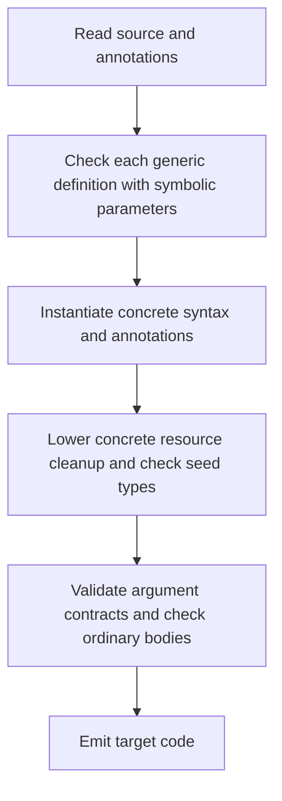

<!-- SPDX-License-Identifier: Apache-2.0 -->

# Generic ownership stage

This optional stage composes the source-generic reader and instantiator with
the ownership checker. The [tutorial](../../../examples/generics/ownership/README.md)
shows setup, definitions, and calls. The ordinary ownership stage and standalone
generic stage remain separate entry points.

## Parameter contract

Every declaration-local type parameter in this profile denotes a sized movable
record with closed ownership. Its complete cleanup requires no domain access.
Distinct parameters have distinct symbolic identities, even when a caller later
supplies the same concrete type for both.

The argument check visits each record in the ownership closure. It follows
inline fields and `owns(field: storage)` targets. A native owned scalar or
pointer-shaped handle ends that path. It rejects stored loans, raw pointer
fields, opaque storage, stable or scoped values, and domain-bound records.
Scalar type arguments require a different parameter profile; this entry point
reports that a record argument is required.

A generic body can transfer, borrow, return, and drop a parameter value. It can
store it in another declared record. Construction of an unknown parameter type,
field selection on it, arithmetic, casts, and `offsetof` on it fail. `sizeof`
and `alignof` produce a symbolic layout query whose value is supplied during
specialization. Owning arrays require aggregate ownership state; this profile
accepts record storage and rejects owning array interfaces.

## Compilation flow



The abstract check operates on source types and ownership facts. Parameter
atoms have no seed declaration, field list, concrete type, size, or layout.
Each function body is checked once with fresh atoms for its parameters.
Callees contribute their substituted interfaces. Their bodies receive their
own independent checks.

The reader and clone callbacks preserve resource destructors, owned fields,
effects, return origins, native resource contracts, access blocks, and trust.
Domain membership can name a generic record family. All instances of that
family inherit the declared domain.

After argument validation, a concrete function instance receives the checked
definition's receipt. The concrete seed checker still checks its types, layout,
and lowered cleanup. Explicit trust and imported concrete interfaces use
separate maps. A failed body check cannot grant trust.

## Interfaces

`ownership_generics_program` uses the ordinary `CrustBuild` request and a list
of root-selected trusted sources. It supports a target suffix in the root
source and extra input paths. The compilation program selects input files;
generic declarations register themselves during reading.

The [lower-level interface](extension.crs) uses `OgProgram`. Load the reader,
resource, ownership, and generic model declarations, then this stage's
[model](model.crs) and interface:

1. Call `og_init` with an allocator and a fresh declaration namespace.
2. Call `og_read` or `og_read_range` for each source. The stage captures the
   source bytes. Select trust with that read operation.
3. Call `og_check`. The checked seed program is in `generics.context` and its
   cleanup plan is in `resources`.
4. Emit with the resource stage's body emitter. Call `og_destroy` after all
   consumers have finished.

`og_prove` checks generic definitions and records their receipts. It permits
additional source inputs before concrete lowering. Parsed declarations,
annotations, source snapshots, and recorded receipts must remain unchanged.
Domain membership becomes fixed with the receipt, including a record's
domain-free status. Additional sources must preserve that membership.
To transform a definition, supply new source and check it as a new definition.
Keep providers alive while the program uses their data.

## Independent libraries

`og_library_publish` checks a closed provider and writes an authenticated
source artifact. `og_library_import` restores it into a fresh program. Read
client sources afterwards; their payload types can be absent at publication.
The original provider paths are retained for diagnostics and are never opened
during import.

The artifact contains captured definition bytes, source identities, parameter
declarations, annotations, and per-declaration checked or trusted status. Its
receipt binds those bytes and the loaded checker image. Publication requires
every external source name to have a provider binding. Duplicate declarations
are rejected on import, so a client cannot replace a bound helper.

An import restores definition receipts and specializes new types without
repeating the generic body proof. The root retains the receipt and supplies a
trusted absolute cache directory, as for ordinary ownership libraries. Source
artifacts contain the definitions needed to generate new instances; they can
be used without a previously emitted specialization object.

## Validation

Run `make check-ownership-generics`. It covers generic body checks, concrete
argument validation, cleanup, loan origins, source-independent imports,
allocation failure, and native trusted-container behavior. Run the ordinary
`check-ownership` and `check-generics` targets for their separate interfaces.

Compiler preparation, frontend checks, emission, and target compilation have
separate measurement boundaries. Keep raw reports and captured inputs under
ignored `build/`.

```sh
python3 tests/ownership_generics_cost.py --work build/ownership-generics-cost
```

The harness compares the container with its handwritten specializations. It
records parsing, abstract proof, specialization, concrete lowering and checks,
argument validation, ordinary ownership checks, emission, and teardown. It also
records proof-body counts, instance reuse, retained arena storage, and separate
proof workspace storage. Preparation and input I/O have separate records.
Target GCC compilation and linking run outside the frontend measurements.

The comparison checks record layouts and emitted operations. Before-and-after
verification output must have identical C and symbol buffers. Captured inputs,
hashes, commands, and raw measurements remain in the selected build directory.
