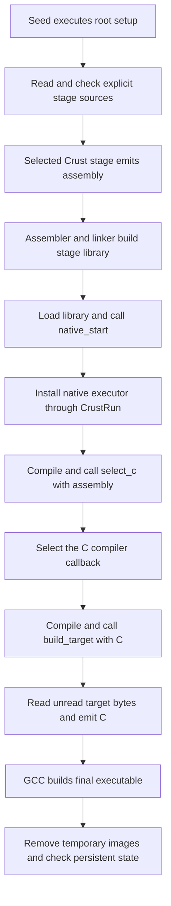

<!-- SPDX-License-Identifier: Apache-2.0 -->

# Native compilation actions

This stage keeps the seed evaluator small. An early root action builds a native
executor and backend from Crust sources. The executor compiles and calls the
following functions. The seed does not need to interpret their bodies.

The [same-file example](../../examples/native/main.crs) builds an executable
with an explicitly loaded assembly stage. Its inputs are the `crust` seed,
`crust-asm-library.so`, the listed Crust sources, GNU assembler, GCC, and the
system libraries.

```sh
make all
build/crust examples/native/main.crs
build/native-hello
```

The output is `Hello from a bootstrapped native stage!`.

## Follow the compilation

The root loads the external assembly library, its interface, and ordinary
stage helper sources. It selects `session.compile` and the library paths that
later native images require.
It creates persistent state, selects source paths and exports, then calls
`native_bootstrap` inside one root block. That block also checks the state
after native execution and returns the final status.



`native_start` installs `crust_run_read`, the compiled `native_execute`, and
the session pointer through `run.read`, `run.execute`, and `run.user`. It enters
`crust_run_loop` synchronously. Each action uses the operations captured before
its read. On completion, `native_start` restores the caller's operations.

The root setup block was already read through its final semicolon. Its nested
runner starts with the next unread function. It does not read the setup again.

## Compilation units

This executor accepts one complete function per action:

```crs
fn configure(root: *CrustRun, state: *u8) -> i32 {
    // Ordinary compilation code. The whole function is compiled once.
    return 0i32;
}
```

The name is free. The signature must be exactly `fn(*CrustRun, *u8) -> i32`.
Zero continues the stream. A nonzero result stops it and supplies its status.
The runner requires a status from 0 through 255. A function can also change
the reader, executor, user pointer, cursor, or completion fields under the
runner contract. EOF ends the stream without an implicit build.

Each function is a complete compilation unit. The stage does not run GCC for
each statement. It rejects bare statements and other declaration actions.
Put related work in the same function. A reader change takes effect at the
next action boundary, not inside a function that has already been read.

The example's second native function passes the unread source range to
`c_program`. Those bytes are target code. The function then completes the root,
so the root executor does not parse them as compilation actions.

## State, identities, and ownership

The seed evaluator retains earlier root variables and interpreted callbacks.
Pass their addresses and function values through `NativeSession.user`. The
example checks the variable address, two copies of an interpreted function
value, and a native function value used by the following unit. Native callbacks
can enter the earlier evaluator synchronously.

Native functions use the existing checked type and external declaration facts.
They can call earlier native actions by name. Earlier interpreted definitions
have no native link name. Pass those function values explicitly. Pass earlier
constant values or addresses through state when they have no native storage.
The emitters reject a reference that lacks a native link name. The stage does
not recompile or relocate previously published values.

Checking adds the new function to the root context. Emission uses a temporary
context with that function as its sole definition. The checked syntax and type
facts remain in the root context. After loading succeeds, the stage changes the
new declaration to an external definition and obtains its native function
value with `crust_eval_function`. It does not prepare an interpreted callable
for that function. The first published callable is therefore the native one.

Each image has a private temporary directory. The entry's exact native name
includes that directory. The linker receives `session.libraries` and preceding images as explicit
dependencies. This allows calls between units with local loader visibility.
No process-wide symbol promotion is required.

The root runner owns every loaded library until its destruction. Temporary
files are removed after the nested loop, including on compilation failure.
Removing a file does not unload its code. Published native callbacks remain
valid through runner destruction. Complete callback use before destroying
the evaluator, its state, or the runner.

## Interfaces and implementation

| File | Responsibility |
| --- | --- |
| [model.crs](model.crs) | Session state and owned temporary image paths |
| [api.crs](api.crs) | Native entry and C compiler declarations |
| [bootstrap.crs](bootstrap.crs) | Explicit source capture, checks, exports, startup, and cleanup |
| [execute.crs](execute.crs) | Function actions, signature checks, emission, publication, and calls |
| [asm.crs](asm.crs) | External assembly stage calls and tool invocation |
| [c.crs](c.crs) | C backend object emission and native linking |
| [linux.crs](linux.crs) | Linux process, file, and temporary-directory operations |

Initialize a session with an empty image list, a selected compiler, user data,
an existing absolute temporary directory, and explicit library dependencies. Keep it and its user storage live through
`native_bootstrap`. The source list contains declaration files. The export
list names defined functions. All paths in the source list are root-relative.

`native_start` retains the caller's `session.compile`. A native action can
replace it with `native_c_image` or another compatible function. The
callback receives checked, named declarations, session state, and a new image.
It must write and link `image.library`, or return false with a diagnostic.
`image.next` lists the preceding images. `session.libraries` lists persistent
external dependencies, including prepared or cached stages. Do not publish a callable before
its image is complete. The session owns every image's cleanup.

These are library policies. Neither the C99 seed nor the launcher recognizes
these file names, export names, or compilation-unit rules. Another stage can
select a different unit boundary and payload through the same runner fields.

## Check and measure

```sh
make check-native
```

The checks cover native address inspection, calls after file cleanup, persistent
state, callback identity, reader replacement, source errors, tool and loader
failures, and an allocation-failure sweep. The unchanged example also runs from
a copied directory with spaces and a different working directory.

The [measurement command](../../benchmarks/native/measure.py) records cold
process totals and separates stage preparation, continuation compilation,
native target frontend and C emission, and final target toolchain work. It
compares the installed native backend and the source-interpreted backend on
the same inputs. No stage result is cached.

```sh
make c-stage
python3 benchmarks/native/measure.py --output build/native-measurement.json
```

The current native handoff route takes the assembly stage as a prepared input
and builds the selected executor and C stage on each invocation. The archived
results below used the C99 assembly implementation at their recorded revision. The target GCC run is
outside frontend timings. Stage preparation and continuation compilation remain
in the total cold cost.

The [recorded results](../../docs/source-runner.md#native-continuation-measurement)
show the cold total and each phase. Native execution reduces the large-input
cost relative to interpretation. The measured cold route still exceeds the
matched GCC syntax-check time.

Use [cold.py](../../benchmarks/native/cold.py) to compare a frozen checkout
with the current build, GCC, and Clang. The
[measurement instructions](../../docs/source-runner.md#compare-cold-native-builds)
give the command and output contract. Keep all stage preparation in the cold
total. A failed one-worker gate blocks parallel scheduler expansion.
