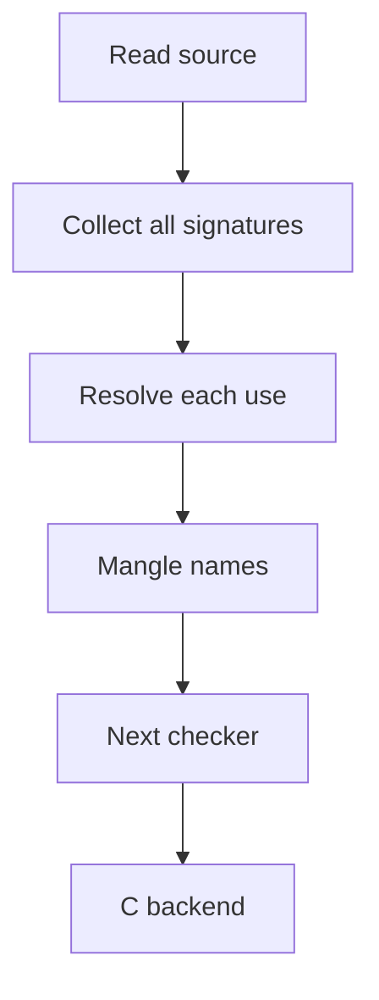

<!-- SPDX-License-Identifier: Apache-2.0 -->

# Tutorial: function overloads as a source stage

The seed language gives each function one name. This stage lets several
functions share a source name when their parameter types differ. It selects
one function during compilation and gives each definition a distinct internal
name. Definitions stay private unless a matching interface declaration selects
a source ABI export. The target does not need a runtime dispatcher.

This tutorial follows that transformation from a greeting to separate object
files. It also explains why overload selection must precede ownership
lowering. Start with [Hello World](../../examples/hello/README.md) and the
[C backend tutorial](../c/README.md). The [reference](reference.md) defines
all selection rules, hook contracts, and native name encodings.

## 1. Run the overloaded greeting

Run from the repository root on Linux x86-64:

```sh
make all overload-stage
build/crust examples/overload/hello/main.crs
build/overload-hello
```

Expected output:

```text
A typed function value.
Hello, overloads!
```

Open [main.crs](../../examples/overload/hello/main.crs). Its compilation
program loads [api.crs](api.crs) and `build/crust-overload-library.so`.
The final `overload_build` call passes the unread range of the same file.
The runner treats this as an ordinary library call.

The target has two definitions:

```crust
fn hello(text: *u8) -> i32 { /* print text */ }
fn hello(count: u32) -> i32 { /* print count greetings */ }
```

These headers summarize the definitions; see the linked source for their
bodies. The string overload wraps the native `puts` call. The integer
overload loops and calls the string overload.

There are two distinct selection operations in `main`:

```crust
var say: fn(*u8) -> i32 = hello;
if say("A typed function value.") != 0i32 { return 1i32; }
return hello(1u32);
```

The declared type of `say` selects a function value by its complete type.
The last call selects an overload by its argument types and count. Its
expected result type does not choose the overload.

## 2. Observe an exact-type rejection

Create a target-only file. The standalone wrapper reads target declarations,
so this file does not contain root setup calls.

```sh
mkdir -p build/tutorial-overload
cat > build/tutorial-overload/types.crs <<'EOF'
fn twice(value: i32) -> i32 { return value + value; }
fn twice(value: u32) -> u32 { return value + value; }

fn main(argc: i32, argv: **u8) -> i32 {
    twice(1u64);
    return 0i32;
}
EOF
build/crust-overload --check build/tutorial-overload/types.crs
```

The last command must return one with this diagnostic:

```text
no overload matches the exact parameter types
```

There is no `u64` parameter in this family. The resolver does not rank
conversions. Make the choice explicit by changing the argument type:

```sh
sed 's/1u64/1u32/' build/tutorial-overload/types.crs \
    > build/tutorial-overload/exact.crs
build/crust-overload --check build/tutorial-overload/exact.crs
```

This command must succeed. A cast to `u32` would also give the call an exact
argument type. Adding another `twice(u32)` with a different result type
would fail at declaration collection: equal parameter lists define the same
overload slot.

Arguments to an overloaded call must have types before selection. If an
argument is itself an overloaded function name, first bind it to an explicit
function type, as `say` does above. This rule avoids recursive candidate
search through the argument expressions.

## 3. Follow collection, selection, and rewriting

The transformation has three operations:



Read the implementation in this order:

| File | What to follow |
| --- | --- |
| [read.crs](read.crs) | A reader hook accepts function definitions and bodyless source declarations |
| [model.crs](model.crs) | `OvGlobal` groups a source name; `OvFunction` holds one signature |
| [collect.crs](collect.crs) | `ov_collect`, duplicate checks, `ov_names`, and `ov_mangle` |
| [types.crs](types.crs) | Structural type keys and exact lookup in `ov_select` |
| [resolve.crs](resolve.crs) | `ov_call` and `ov_function_value` select and rewrite references |
| [program.crs](program.crs) | `ov_check` and the driver connect the transformation to the next checker |

### Collect interfaces before bodies

`ov_collect` groups functions by their original source name. Each group has
a table keyed by the parameter type list. The resolver can therefore call
a function declared later in the file. A matching prototype and definition
share one canonical entry; two definitions produce an error.

Type keys encode structure. A function type includes its parameter and
result types. A named record uses its declared name. Complete key bytes
are interned, and hash collisions are checked against those bytes.
Selection uses the table; it does not run the full checker for each candidate.

The stage caches type keys by source syntax node. Selection keys use the
identities of interned type keys, so calls do not copy a long type encoding.
These identities stay in the context. Native names use the complete structural
encodings and contain no addresses. Keep source signatures
and record fields unchanged between collection and mangling. A later
stage can lower them after selection.

### Preserve source scope during rewriting

`ov_call` determines argument types, constructs the parameter key, and
selects a family member. `ov_function_value` can use an expected complete
function type. The visitor replaces the reference with an internal name.
`ov_mangle` then changes declarations and removes duplicate prototypes.

Internal names have a reserved form that source identifiers cannot spell.
They are distinct from native link names. Scope checks still use original
source names. Otherwise, renaming a global could accidentally allow a local
to hide it and change source scope rules.

This pass provides enough source typing to select functions. The next
checker still validates the resulting operations. In the standalone
package, that is the seed checker. In the resource package, ownership
checking and lowering run before the seed checks generated operations.

## 4. Test the separate compilation boundary

Run the separate-object example:

```sh
build/crust examples/overload/separate/main.crs
build/overload-separate
nm -g build/overload-format.o
```

The program prints `types: 42` and a newline. In `nm` output, find the two
defined symbols that contain `n6_format`. They have distinct parameter
encodings. Other symbols, including the native `write` import, can also
appear.

The [root](../../examples/overload/separate/main.crs) performs two builds.
First it compiles [provider.crs](../../examples/overload/separate/provider.crs)
and [interface.crs](../../examples/overload/separate/interface.crs) into an
object. Then it compiles its inline caller with that same interface and
links the object. A source import uses a bodyless declaration:

```crust
fn format(output: *Output, value: u64) -> i32;
fn format(output: *Output, text: *u8) -> i32;
```

The same declarations select the provider's exports. Definitions without a
matching bodyless declaration stay private. Two libraries can each define
their own `helper` without a link collision or shared-library interposition.

An explicit `extern fn ... = "symbol";` declares a native ABI binding.
It has a different contract from these source imports.

### Names must agree without shared compiler state

Each source ABI import or export uses a name with a format version, ABI domain,
source name, parameter types, result type, and declaration contract. It
contains no path, declaration position, or allocation address. The caller
and provider can therefore calculate the same name independently.

For example, add `fn twice(value: i32) -> i32;` to the `twice` source above.
This selects its `i32` definition for export with this native symbol:

```text
crust_ov1_d13_crust0_x64_v1n5_twicea1_b4_rb4_c1_s
```

The [reference](reference.md#native-name-format) explains each part. The
native name contains the result type even though call selection does not
use it. Matching calls and matching native ABI contracts are separate tasks.

Record names are nominal. Mangling does not detect a changed record layout
under the same name. Caller and provider must share record definitions and
the ABI domain. Use a shared interface file. Distinct libraries with
different meanings for the same type name need distinct ABI domains.

The C backend first emits private C identifiers, then applies these native
names with its symbol response file. Neither the overload stage nor the
backend needs a runtime lookup table in the target.

## 5. Compose with ownership before types are lowered

Run the composed example:

```sh
build/crust examples/overload/resources/main.crs
build/overload-resources
```

Expected output:

```text
Owned overloads.
Deferred overload.
```

The [source](../../examples/overload/resources/main.crs) overloads `write`
and the resource drop function `release`. The adapter in
[resources.crs](resources.crs) selects each drop by `fn(mut Resource)->unit`.
It preserves `read`, `mut`, and unsafe function contracts during selection.

Both borrow modes eventually lower to pointers. Selecting overloads after
that lowering would lose the distinction. The correct sequence is:

1. Initialize `RsStage`, then `ov_resources_init` with caller-owned hooks.
2. Read all inputs with `ov_resources_read`.
3. Call `ov_resources_prepare` to select calls and drops and assign names.
4. Call `rs_prepare` to check ownership and construct cleanup plans.
5. Emit with the resource stage's body callback.

The adapter marks bodyless declarations as source ABI imports before
resource preparation. Without that marker, the resource checker would
treat them as native foreign calls and apply the wrong signature contract.

`OvHooks` supplies type encoding, binding value types, expression traversal,
statement traversal, and declaration contracts. The resolver itself has no
resource-specific syntax cases. An unhandled expression or statement hook
must leave the node unchanged. Unknown syntax must reach a diagnostic,
not disappear from the walk. See [extension.crs](extension.crs) and the
[hook reference](reference.md#public-composition-api) before writing a hook.

## 6. Check costs and lifetimes

The function reader hook uses one level of the reader's 256-level traversal
budget. A function can contain 252 nested blocks around either a return or a
scalar assignment. Composition with resource lowering reduces these values to
250 and 249. These are the exact source shapes in the
[stage limit table](../reader/README.md); other syntax can consume more levels.

Keep the context, source bytes, stage, and hooks live through their uses.
One context shares an arena and a key buffer, so its operations are serial.
Independent builds use independent contexts. The pass collects signatures
once and looks up exact keys; this is a design property, not a measured
claim that every program compiles as fast as C.

`--check` stops after semantic checks. `--prepare` also builds C text in
memory. Both exclude target GCC compilation and linking. The
[measurement method](../../benchmarks/overload/README.md) compares explicit
names with overload selection under those boundaries.

Run `make check-overload` for selection, diagnostics, native symbols,
separate objects, generic hooks, and resource composition. Run
`make check-overload-alloc` for allocation failure checks. Continue with the
[resource tutorial](../resources/README.md) to follow moves, loans, and
cleanup emission in detail.
